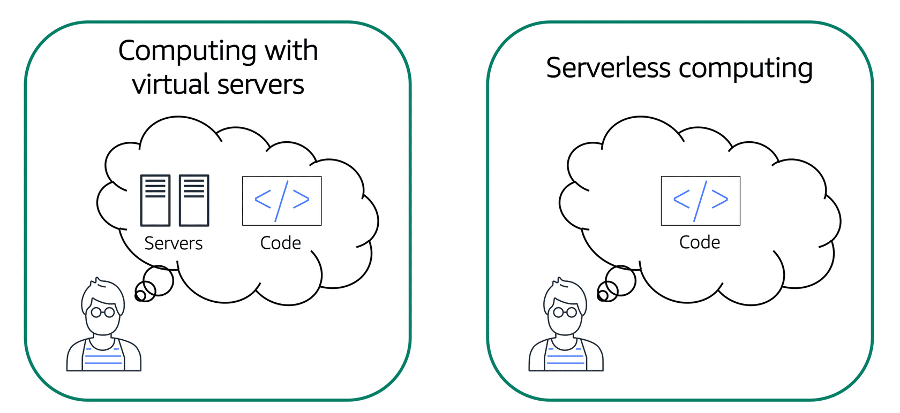
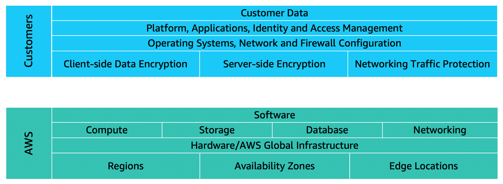

# AWS Cloud Practitioner Essentials

## 1 - Introduction to the AWS Cloud

### What is a client-server model?

In computing, a client can be a web browser or desktop application that a person interacts with to make requests to computer servers. A server can be services, such as Amazon Elastic Compute Cloud (Amazon EC2) – a type of virtual server.


For example, suppose that a client makes a request for a news article, the score in an online game, or a funny video. The server evaluates the details of this request and fulfills it by returning the information to the client.

### Deployment models for cloud computing

When selecting a cloud strategy, a company must consider factors such as required cloud application components, preferred resource management tools, and any legacy IT infrastructure requirements.

The three cloud computing deployment models are cloud-based, on-premises, and hybrid.

- **Cloud-based**  
    In a cloud-based deployment model, you can migrate existing applications to the cloud, or you can design and build new applications in the cloud. You can build those applications on low-level infrastructure that requires your IT staff to manage them. Alternatively, you can build them using higher-level services that reduce the management, architecting, and scaling requirements of the core infrastructure. For example, a company might create an application consisting of virtual servers, databases, and networking components that are fully based in the cloud.

- **On-premises**  
    On-premises deployment is also known as a private cloud deployment. In this model, resources are deployed on premises by using virtualization and resource management tools. For example, you might have applications that run on technology that is fully kept in your on-premises data center. Though this model is much like legacy IT infrastructure, its incorporation of application management and virtualization technologies helps to increase resource utilization.

- **Hybrid**  
    In a hybrid deployment, cloud-based resources are connected to on-premises infrastructure. You might want to use this approach in a number of situations. For example, you have legacy applications that are better maintained on premises, or government regulations require your business to keep certain records on premises. For example, suppose that a company wants to use cloud services that can automate batch data processing and analytics. However, the company has several legacy applications that are more suitable on premises and will not be migrated to the cloud. With a hybrid deployment, the company would be able to keep the legacy applications on premises while benefiting from the data and analytics services that run in the cloud.

### Benefits of cloud computing

Consider why a company might choose to take a particular cloud computing approach when addressing business needs.

- **Trade upfront expense for variable expense**  
    Upfront expense refers to data centers, physical servers, and other resources that you would need to invest in before using them. Variable expense means you only pay for computing resources you consume instead of investing heavily in data centers and servers before you know how you’re going to use them. By taking a cloud computing approach that offers the benefit of variable expense, companies can implement innovative solutions while saving on costs.

- **Stop spending money to run and mantain data centers**  
    Computing in data centers often requires you to spend more money and time managing infrastructure and servers. A benefit of cloud computing is the ability to focus less on these tasks and more on your applications and customers.

- **Stop guessing capacity**  
    With cloud computing, you don’t have to predict how much infrastructure capacity you will need before deploying an application. For example, you can launch Amazon EC2 instances when needed, and pay only for the compute time you use. Instead of paying for unused resources or having to deal with limited capacity, you can access only the capacity that you need. You can also scale in or scale out in response to demand.

- **Benefit from massive economies of scale**  
    By using cloud computing, you can achieve a lower variable cost than you can get on your own. Because usage from hundreds of thousands of customers can aggregate in the cloud, providers, such as AWS, can achieve higher economies of scale. The economy of scale translates into lower pay-as-you-go prices.

- **Increase speed and agility**  
    The flexibility of cloud computing makes it easier for you to develop and deploy applications. This flexibility provides you with more time to experiment and innovate. When computing in data centers, it may take weeks to obtain new resources that you need. By comparison, cloud computing enables you to access new resources within minutes.

- **Go global in minutes**  
    The global footprint of the AWS Cloud enables you to deploy applications to customers around the world quickly, while providing them with low latency. This means that even if you are located in a different part of the world than your customers, customers are able to access your applications with minimal delays.

## 2 - Compute in the Cloud

### Amazon Elastic Compute Cloud (Amazon EC2)

Amazon Elastic Compute Cloud (Amazon EC2) provides secure, resizable compute capacity in the cloud as Amazon EC2 instances.

Imagine you are responsible for the architecture of your company's resources and need to support new websites. With traditional on-premises resources, you have to do the following:

- Spend money upfront to purchase hardware.
- Wait for the servers to be delivered to you.
- Install the servers in your physical data center.
- Make all the necessary configurations.

By comparison, with an Amazon EC2 instance you can use a virtual server to run applications in the AWS Cloud.

- You can provision and launch an Amazon EC2 instance within minutes.
- You can stop using it when you have finished running a workload.
- You pay only for the compute time you use when an instance is running, not when it is stopped or terminated.
- You can save costs by paying only for server capacity that you need or want.

### Amazon EC2 instance types

Amazon EC2 instance types are optimized for different tasks. When selecting an instance type, consider the specific needs of your workloads and applications. This might include requirements for compute, memory, or storage capabilities.

- **General purpose**  
    General purpose instances provide a balance of compute, memory, and networking resources. You can use them for a variety of workloads, such as:
        - application servers
        - gaming servers
        - backend servers for enterprise applications
        - small and medium databases  
    Suppose that you have an application in which the resource needs for compute, memory, and networking are roughly equivalent. You might consider running it on a general purpose instance because the application does not require optimization in any single resource area.

- **Compute optimized**  
    Compute optimized instances are ideal for compute-bound applications that benefit from high-performance processors. Like general purpose instances, you can use compute optimized instances for workloads such as web, application, and gaming servers.  
    However, the difference is compute optimized applications are ideal for high-performance web servers, compute-intensive applications servers, and dedicated gaming servers. You can also use compute optimized instances for batch processing workloads that require processing many transactions in a single group.

- **Memory optimized**  
    Memory optimized instances are designed to deliver fast performance for workloads that process large datasets in memory. In computing, memory is a temporary storage area. It holds all the data and instructions that a central processing unit (CPU) needs to be able to complete actions. Before a computer program or application is able to run, it is loaded from storage into memory. This preloading process gives the CPU direct access to the computer program.  
    Suppose that you have a workload that requires large amounts of data to be preloaded before running an application. This scenario might be a high-performance database or a workload that involves performing real-time processing of a large amount of unstructured data. In these types of use cases, consider using a memory optimized instance. Memory optimized instances enable you to run workloads with high memory needs and receive great performance.

- **Accelerated computing**  
    Accelerated computing instances use hardware accelerators, or coprocessors, to perform some functions more efficiently than is possible in software running on CPUs. Examples of these functions include floating-point number calculations, graphics processing, and data pattern matching.  
    In computing, a hardware accelerator is a component that can expedite data processing. Accelerated computing instances are ideal for workloads such as graphics applications, game streaming, and application streaming.

- **Storage optimized**  
    Storage optimized instances are designed for workloads that require high, sequential read and write access to large datasets on local storage. Examples of workloads suitable for storage optimized instances include distributed file systems, data warehousing applications, and high-frequency online transaction processing (OLTP) systems.  
    In computing, the term input/output operations per second (IOPS) is a metric that measures the performance of a storage device. It indicates how many different input or output operations a device can perform in one second. Storage optimized instances are designed to deliver tens of thousands of low-latency, random IOPS to applications.  
    You can think of input operations as data put into a system, such as records entered into a database. An output operation is data generated by a server. An example of output might be the analytics performed on the records in a database. If you have an application that has a high IOPS requirement, a storage optimized instance can provide better performance over other instance types not optimized for this kind of use case.

### Amazon EC2 pricing

With Amazon EC2, you pay only for the compute time that you use. Amazon EC2 offers a variety of pricing options for different use cases. For example, if your use case can withstand interruptions, you can save with Spot Instances. You can also save by committing early and locking in a minimum level of use with Reserved Instances.

- **On-Demand Instances**  
    On-Demand Instances are ideal for short-term, irregular workloads that cannot be interrupted. No upfront costs or minimum contracts apply. The instances run continuously until you stop them, and you pay for only the compute time you use.  
    Sample use cases for On-Demand Instances include developing and testing applications and running applications that have unpredictable usage patterns. On-Demand Instances are not recommended for workloads that last a year or longer because these workloads can experience greater cost savings using Reserved Instances.

- **Reserved Instances**  
    Reserved Instances are a billing discount applied to the use of On-Demand Instances in your account. There are two available types of Reserved Instances:
        - Standard Reserved Instances
        - Convertible Reserved Instances  
    You can purchase Standard Reserved and Convertible Reserved Instances for a 1-year or 3-year term. You realize greater cost savings with the 3-year option.  
    Standard Reserved Instances: This option is a good fit if you know the EC2 instance type and size you need for your steady-state applications and in which AWS Region you plan to run them. Reserved Instances require you to state the following qualifications:
        - Instance type and size: For example, m5.xlarge
        - Platform description (operating system): For example, Microsoft Windows Server or Red Hat Enterprise Linux
        - Tenancy: Default tenancy or dedicated tenancy  
    You have the option to specify an Availability Zone for your EC2 Reserved Instances. If you make this specification, you get EC2 capacity reservation. This ensures that your desired amount of EC2 instances will be available when you need them.  
    Convertible Reserved Instances: If you need to run your EC2 instances in different Availability Zones or different instance types, then Convertible Reserved Instances might be right for you. Note: You trade in a deeper discount when you require flexibility to run your EC2 instances.  
    At the end of a Reserved Instance term, you can continue using the Amazon EC2 instance without interruption. However, you are charged On-Demand rates until you do one of the following:
        - Terminate the instance.
        - Purchase a new Reserved Instance that matches the instance attributes (instance family and size, Region, platform, and tenancy).

- **Instance Savings Plans**  
    AWS offers Savings Plans for a few compute services, including Amazon EC2. EC2 Instance Savings Plans reduce your EC2 instance costs when you make an hourly spend commitment to an instance family and Region for a 1-year or 3-year term. This term commitment results in savings of up to 72 percent compared to On-Demand rates. Any usage up to the commitment is charged at the discounted Savings Plans rate (for example, $10 per hour). Any usage beyond the commitment is charged at regular On-Demand rates.  
    The EC2 Instance Savings Plans are a good option if you need flexibility in your Amazon EC2 usage over the duration of the commitment term. You have the benefit of saving costs on running any EC2 instance within an EC2 instance family in a chosen Region (for example, M5 usage in N. Virginia) regardless of Availability Zone, instance size, OS, or tenancy. The savings with EC2 Instance Savings Plans are similar to the savings provided by Standard Reserved Instances.  
    Unlike Reserved Instances, however, you don't need to specify up front what EC2 instance type and size (for example, m5.xlarge), OS, and tenancy to get a discount. Further, you don't need to commit to a certain number of EC2 instances over a 1-year or 3-year term. Additionally, the EC2 Instance Savings Plans don't include an EC2 capacity reservation option.  

- **Spot Instances**  
    Spot Instances are ideal for workloads with flexible start and end times, or that can withstand interruptions. Spot Instances use unused Amazon EC2 computing capacity and offer you cost savings at up to 90% off of On-Demand prices.  
    Suppose that you have a background processing job that can start and stop as needed (such as the data processing job for a customer survey). You want to start and stop the processing job without affecting the overall operations of your business. If you make a Spot request and Amazon EC2 capacity is available, your Spot Instance launches. However, if you make a Spot request and Amazon EC2 capacity is unavailable, the request is not successful until capacity becomes available. The unavailable capacity might delay the launch of your background processing job.  
    After you have launched a Spot Instance, if capacity is no longer available or demand for Spot Instances increases, your instance may be interrupted. This might not pose any issues for your background processing job. However, in the earlier example of developing and testing applications, you would most likely want to avoid unexpected interruptions. Therefore, choose a different EC2 instance type that is ideal for those tasks.

- **Dedicated hosts**  
    Dedicated Hosts are physical servers with Amazon EC2 instance capacity that is fully dedicated to your use.  
    You can use your existing per-socket, per-core, or per-VM software licenses to help maintain license compliance. You can purchase On-Demand Dedicated Hosts and Dedicated Hosts Reservations. Of all the Amazon EC2 options that were covered, Dedicated Hosts are the most expensive.

### Scaling with Amazon EC2

Scalability involves beginning with only the resources you need and designing your architecture to automatically respond to changing demand by scaling out or in. As a result, you pay for only the resources you use. You don’t have to worry about a lack of computing capacity to meet your customers’ needs.

If you wanted the scaling process to happen automatically, which AWS service would you use? The AWS service that provides this functionality for Amazon EC2 instances is Amazon EC2 Auto Scaling.

If you’ve tried to access a website that wouldn’t load and frequently timed out, the website might have received more requests than it was able to handle. This situation is similar to waiting in a long line at a coffee shop, when there is only one barista present to take orders from customers.

Amazon EC2 Auto Scaling enables you to automatically add or remove Amazon EC2 instances in response to changing application demand. By automatically scaling your instances in and out as needed, you can maintain a greater sense of application availability.

Within Amazon EC2 Auto Scaling, you can use two approaches:

- Dynamic scaling responds to changing demand.

- Predictive scaling automatically schedules the right number of Amazon EC2 instances based on predicted demand.


In the cloud, computing power is a programmatic resource, so you can take a more flexible approach to the issue of scaling. By adding Amazon EC2 Auto Scaling to an application, you can add new instances to the application when necessary and terminate them when no longer needed.

Suppose that you are preparing to launch an application on Amazon EC2 instances. When configuring the size of your Auto Scaling group, you might set the minimum number of Amazon EC2 instances at one. This means that at all times, there must be at least one Amazon EC2 instance running.


When you create an Auto Scaling group, you can set the minimum number of Amazon EC2 instances. The minimum capacity is the number of Amazon EC2 instances that launch immediately after you have created the Auto Scaling group. In this example, the Auto Scaling group has a minimum capacity of one Amazon EC2 instance.

Next, you can set the desired capacity at two Amazon EC2 instances even though your application needs a minimum of a single Amazon EC2 instance to run.

The third configuration that you can set in an Auto Scaling group is the maximum capacity. For example, you might configure the Auto Scaling group to scale out in response to increased demand, but only to a maximum of four Amazon EC2 instances.

Because Amazon EC2 Auto Scaling uses Amazon EC2 instances, you pay for only the instances you use, when you use them. You now have a cost-effective architecture that provides the best customer experience while reducing expenses.

### Directing traffic with Elastic Load Balancing

Elastic Load Balancing is the AWS service that automatically distributes incoming application traffic across multiple resources, such as Amazon EC2 instances.

A load balancer acts as a single point of contact for all incoming web traffic to your Auto Scaling group. This means that as you add or remove Amazon EC2 instances in response to the amount of incoming traffic, these requests route to the load balancer first. Then, the requests spread across multiple resources that will handle them. For example, if you have multiple Amazon EC2 instances, Elastic Load Balancing distributes the workload across the multiple instances so that no single instance has to carry the bulk of it.

Although Elastic Load Balancing and Amazon EC2 Auto Scaling are separate services, they work together to help ensure that applications running in Amazon EC2 can provide high performance and availability.

Here’s an example of how Elastic Load Balancing works. Suppose that a few customers have come to the coffee shop and are ready to place their orders.

If only a few registers are open, this matches the demand of customers who need service. The coffee shop is less likely to have open registers with no customers. In this example, you can think of the registers as Amazon EC2 instances.


Throughout the day, as the number of customers increases, the coffee shop opens more registers to accommodate them.

Additionally, a coffee shop employee directs customers to the most appropriate register so that the number of requests can evenly distribute across the open registers. You can think of this coffee shop employee as a load balancer.


### Messaging and queuing services

Applications are made of multiple components. The components communicate with each other to transmit data, fulfill requests, and keep the application running.

Suppose that you have an application with tightly coupled components. These components might include databases, servers, the user interface, business logic, and so on. This type of architecture can be considered a monolithic application.

In this approach to application architecture, if a single component fails, other components fail, and possibly the entire application fails.


To help maintain application availability when a single component fails, you can design your application through a microservices approach.

In a microservices approach, application components are loosely coupled. In this case, if a single component fails, the other components continue to work because they are communicating with each other. The loose coupling prevents the entire application from failing.

When designing applications on AWS, you can take a microservices approach with services and components that fulfill different functions. Two services facilitate application integration: Amazon Simple Notification Service (Amazon SNS) and Amazon Simple Queue Service (Amazon SQS).


#### Amazon Simple Notification Service (Amazon SNS)

Amazon Simple Notification Service (Amazon SNS) is a publish/subscribe service. Using Amazon SNS topics, a publisher publishes messages to subscribers. This is similar to the coffee shop; the cashier provides coffee orders to the barista who makes the drinks.


Suppose that the coffee shop has a single newsletter that includes updates from all areas of its business. It includes topics such as coupons, coffee trivia, and new products. All of these topics are grouped because this is a single newsletter. All customers who subscribe to the newsletter receive updates about coupons, coffee trivia, and new products.

After a while, some customers express that they would prefer to receive separate newsletters for only the specific topics that interest them. The coffee shop owners decide to try this approach.


Now, instead of having a single newsletter for all topics, the coffee shop has broken it up into three separate newsletters. Each newsletter is devoted to a specific topic: coupons, coffee trivia, and new products.

Subscribers will now receive updates immediately for only the specific topics to which they have subscribed.

It is possible for subscribers to subscribe to a single topic or to multiple topics. For example, the first customer subscribes to only the coupons topic, and the second subscriber subscribes to only the coffee trivia topic. The third customer subscribes to both the coffee trivia and new products topics.

Although these examples from the coffee shop involve subscribers who are people, in Amazon SNS, subscribers can be web servers, email addresses, AWS Lambda functions, or several other options.

#### Amazon Simple Queue Service (Amazon SQS)

Using Amazon SQS, you can send, store, and receive messages between software components, without losing messages or requiring other services to be available. In Amazon SQS, an application sends messages into a queue. A user or service retrieves a message from the queue, processes it, and then deletes it from the queue.


Suppose that the coffee shop has an ordering process in which a cashier takes orders, and a barista makes the orders. Think of the cashier and the barista as two separate components of an application.

First, the cashier takes an order and writes it down on a piece of paper. Next, the cashier delivers the paper to the barista. Finally, the barista makes the drink and gives it to the customer.

When the next order comes in, the process repeats. This process runs smoothly as long as both the cashier and the barista are coordinated.

What might happen if the cashier took an order and went to deliver it to the barista, but the barista was out on a break or busy with another order? The cashier would need to wait until the barista is ready to accept the order. This would cause delays in the ordering process and require customers to wait longer to receive their orders.

As the coffee shop has become more popular and the ordering line is moving more slowly, the owners notice that the current ordering process is time consuming and inefficient. They decide to try a different approach that uses a queue.


Recall that the cashier and the barista are two separate components of an application. A message queuing service, such as Amazon SQS, lets messages between decoupled application complements.

In this example, the first step in the process remains the same as before: a customer places an order with the cashier.

The cashier puts the order into a queue. You can think of this as an order board that serves as a buffer between the cashier and the barista. Even if the barista is out on a break or busy with another order, the cashier can continue placing new orders into the queue.

Next, the barista checks the queue and retrieves the order.

The barista prepares the drink and gives it to the customer.

The barista then removes the completed order from the queue.

While the barista is preparing the drink, the cashier is able to continue taking new orders and add them to the queue.

For decoupled applications and microservices, Amazon SQS enables you to send, store, and retrieve messages between components.

This decoupled approach enables the separate components to work more efficiently and independently.

### Additional compute services

#### Serverless computing

If you have applications that you want to run in Amazon EC2, you must do the following:

- Provision instances (virtual servers).

- Upload your code.

- Continue to manage the instances while your application is running.



The term “serverless” means that your code runs on servers, but you do not need to provision or manage these servers. With serverless computing, you can focus more on innovating new products and features instead of maintaining servers.

Another benefit of serverless computing is the flexibility to scale serverless applications automatically. Serverless computing can adjust the applications' capacity by modifying the units of consumptions, such as throughput and memory.

AWS Lambda is a service that lets you run code without needing to provision or manage servers.

While using AWS Lambda, you pay only for the compute time that you consume. Charges apply only when your code is running. You can also run code for virtually any type of application or backend service, all with zero administration.

For example, a simple Lambda function might involve automatically resizing uploaded images to the AWS Cloud. In this case, the function triggers when uploading a new image.


#### Containers

Containers provide you with a standard way to package your application's code and dependencies into a single object. You can also use containers for processes and workflows in which there are essential requirements for security, reliability, and scalability.


Suppose that a company’s application developer has an environment on their computer that is different from the environment on the computers used by the IT operations staff. The developer wants to ensure that the application’s environment remains consistent regardless of deployment, so they use a containerized approach. This helps to reduce time spent debugging applications and diagnosing differences in computing environments.


When running containerized applications, it’s important to consider scalability. Suppose that instead of a single host with multiple containers, you have to manage tens of hosts with hundreds of containers. Alternatively, you have to manage possibly hundreds of hosts with thousands of containers. At a large scale, imagine how much time it might take for you to monitor memory usage, security, logging, and so on.

To help manage containers at scale, you can use Amazon Elastic Container Service (Amazon ECS) or Amazon Elastic Kubernetes Service (Amazon EKS).

#### Amazon Elastic Container Service (Amazon ECS)

Amazon Elastic Container Service (Amazon ECS) is a highly scalable, high-performance container management system that enables you to run and scale containerized applications on AWS.

Amazon ECS supports Docker containers. Docker is a software platform that enables you to build, test, and deploy applications quickly. AWS supports the use of open-source Docker Community Edition and subscription-based Docker Enterprise Edition. With Amazon ECS, you can use API calls to launch and stop Docker-enabled applications.

#### Amazon Elastic Kubernetes Service (Amazon EKS)

Amazon Elastic Kubernetes Service (Amazon EKS) is a fully managed service that you can use to run Kubernetes on AWS.

Kubernetes is open-source software that enables you to deploy and manage containerized applications at scale. A large community of volunteers maintains Kubernetes, and AWS actively works together with the Kubernetes community. As new features and functionalities release for Kubernetes applications, you can easily apply these updates to your applications managed by Amazon EKS.

#### AWS Fargate

AWS Fargate is a serverless compute engine for containers. It works with both Amazon ECS and Amazon EKS.

When using AWS Fargate, you do not need to provision or manage servers. AWS Fargate manages your server infrastructure for you. You can focus more on innovating and developing your applications, and you pay only for the resources that are required to run your containers.

## 3 - Global infrastructure and reliability

### AWS global infrastructure

To understand the AWS global infrastructure, consider the coffee shop. If an event such as a parade, flood, or power outage impacts one location, customers can still get their coffee by visiting a different location only a few blocks away.

This is similar to how the AWS global infrastructure works.

#### Regions

When determining the right Region for your services, data, and applications, consider the following four business factors.

- **Compliance with data governance requirements**  
    Depending on your company and location, you might need to run your data out of specific areas. For example, if your company requires all of its data to reside within the boundaries of the UK, you would choose the London Region.  
    Not all companies have location-specific data regulations, so you might need to focus more on the other three factors.

- **Proximity to customers**  
    Selecting a Region that is close to your customers will help you to get content to them faster. For example, your company is based in Washington, DC, and many of your customers live in Singapore. You might consider running your infrastructure in the Northern Virginia Region to be close to company headquarters, and run your applications from the Singapore Region.

- **Services available in a Region**
    Sometimes, the closest Region might not have all the features that you want to offer to customers. AWS is frequently innovating by creating new services and expanding on features within existing services. However, making new services available around the world sometimes requires AWS to build out physical hardware one Region at a time.  
    Suppose that your developers want to build an application that uses Amazon Braket (AWS quantum computing platform). As of this course, Amazon Braket is not yet available in every AWS Region around the world, so your developers would have to run it in one of the Regions that already offers it.

- **Pricing**  
    Suppose that you are considering running applications in both the United States and Brazil. The way Brazil’s tax structure is set up, it might cost 50% more to run the same workload out of the São Paulo Region compared to the Oregon Region. You will learn in more detail that several factors determine pricing, but for now know that the cost of services can vary from Region to Region.

#### Availability Zones

An Availability Zone is a single data center or a group of data centers within a Region. Availability Zones are located tens of miles apart from each other. This is close enough to have low latency (the time between when content requested and received) between Availability Zones. However, if a disaster occurs in one part of the Region, they are distant enough to reduce the chance that multiple Availability Zones are affected.


Suppose that you’re running an application on a single Amazon EC2 instance in the Northern California Region. The instance is running in the us-west-1a Availability Zone. If us-west-1a were to fail, you would lose your instance.

A best practice is to run applications across at least two Availability Zones in a Region. In this example, you might choose to run a second Amazon EC2 instance in us-west-1b.

If us-west-1a were to fail, your application would still be running in us-west-1b.


#### Edge locations

An edge location is a site that Amazon CloudFront uses to store cached copies of your content closer to your customers for faster delivery.


Suppose that your company’s data is stored in Brazil, and you have customers who live in China. To provide content to these customers, you don’t need to move all the content to one of the Chinese Regions.

Instead of requiring your customers to get their data from Brazil, you can cache a copy locally at an edge location that is close to your customers in China.

When a customer in China requests one of your files, Amazon CloudFront retrieves the file from the cache in the edge location and delivers the file to the customer. The file is delivered to the customer faster because it came from the edge location near China instead of the original source in Brazil.

#### AWS Management Console

The AWS Management Console is a web-based interface for accessing and managing AWS services. You can quickly access recently used services and search for other services by name, keyword, or acronym. The console includes wizards and automated workflows that can simplify the process of completing tasks.

You can also use the AWS Console mobile application to perform tasks such as monitoring resources, viewing alarms, and accessing billing information. Multiple identities can stay logged into the AWS Console mobile app at the same time.

#### AWS Command Line Interface (AWS CLI)

To save time when making API requests, you can use the AWS Command Line Interface (AWS CLI). AWS CLI enables you to control multiple AWS services directly from the command line within one tool. AWS CLI is available for users on Windows, macOS, and Linux.

By using AWS CLI, you can automate the actions that your services and applications perform through scripts. For example, you can use commands to launch an Amazon EC2 instance, connect an Amazon EC2 instance to a specific Auto Scaling group, and more.

#### AWS Software Development Kits (SDKs)

Another option for accessing and managing AWS services is the software development kits (SDKs). SDKs make it easier for you to use AWS services through an API designed for your programming language or platform. SDKs enable you to use AWS services with your existing applications or create entirely new applications that will run on AWS.

To help you get started with using SDKs, AWS provides documentation and sample code for each supported programming language. Supported programming languages include C++, Java, .NET, and more.

#### AWS Elastic Beanstalk

With AWS Elastic Beanstalk, you provide code and configuration settings, and Elastic Beanstalk deploys the resources necessary to perform the following tasks:

- Adjust capacity
- Load balancing
- Automatic scaling
- Application health monitoring

#### AWS CloudFormation

With AWS CloudFormation, you can treat your infrastructure as code. This means that you can build an environment by writing lines of code instead of using the AWS Management Console to individually provision resources.

AWS CloudFormation provisions your resources in a safe, repeatable manner, enabling you to frequently build your infrastructure and applications without having to perform manual actions. It determines the right operations to perform when managing your stack and rolls back changes automatically if it detects errors.

## 4 - Networking

### Connectivity to AWS

#### Amazon Virtual Private Cloud (Amazon VPC)

Imagine the millions of customers who use AWS services. Also, imagine the millions of resources that these customers have created, such as Amazon EC2 instances. Without boundaries around all of these resources, network traffic would be able to flow between them unrestricted.

A networking service that you can use to establish boundaries around your AWS resources is Amazon Virtual Private Cloud (Amazon VPC).

Amazon VPC enables you to provision an isolated section of the AWS Cloud. In this isolated section, you can launch resources in a virtual network that you define. Within a virtual private cloud (VPC), you can organize your resources into subnets. A subnet is a section of a VPC that can contain resources such as Amazon EC2 instances.

#### Internet Gateway

To allow public traffic from the internet to access your VPC, you attach an internet gateway to the VPC.


An internet gateway is a connection between a VPC and the internet. You can think of an internet gateway as being similar to a doorway that customers use to enter the coffee shop. Without an internet gateway, no one can access the resources within your VPC. But what if you have a VPC that includes only private resources?

#### Virtual private gateway

To access private resources in a VPC, you can use a virtual private gateway.

Here’s an example of how a virtual private gateway works. You can think of the internet as the road between your home and the coffee shop. Suppose that you are traveling on this road with a bodyguard to protect you. You are still using the same road as other customers, but with an extra layer of protection.

The bodyguard is like a virtual private network (VPN) connection that encrypts (or protects) your internet traffic from all the other requests around it.

The virtual private gateway is the component that allows protected internet traffic to enter into the VPC. Even though your connection to the coffee shop has extra protection, traffic jams are possible because you’re using the same road as other customers.


A virtual private gateway enables you to establish a virtual private network (VPN) connection between your VPC and a private network, such as an on-premises data center or internal corporate network. A virtual private gateway allows traffic into the VPC only if it is coming from an approved network.

#### Direct Connect

AWS Direct Connect is a service that lets you to establish a dedicated private connection between your data center and a VPC.  

Suppose that there is an apartment building with a hallway directly linking the building to the coffee shop. Only the residents of the apartment building can travel through this hallway.

This private hallway provides the same type of dedicated connection as AWS Direct Connect. Residents are able to get into the coffee shop without needing to use the public road shared with other customers.


The private connection that AWS Direct Connect provides helps you to reduce network costs and increase the amount of bandwidth that can travel through your network.

### Subnets and Network Access Control Lists (NACLs)

To learn more about the role of subnets within a VPC, review the following example from the coffee shop.

First, customers give their orders to the cashier. The cashier then passes the orders to the barista. This process allows the line to keep running smoothly as more customers come in.

Suppose that some customers try to skip the cashier line and give their orders directly to the barista. This disrupts the flow of traffic and results in customers accessing a part of the coffee shop that is restricted to them.


To fix this, the owners of the coffee shop divide the counter area by placing the cashier and the barista in separate workstations. The cashier’s workstation is public facing and designed to receive customers. The barista’s area is private. The barista can still receive orders from the cashier but not directly from customers.


This is similar to how you can use AWS networking services to isolate resources and determine exactly how network traffic flows.

In the coffee shop, you can think of the counter area as a VPC. The counter area divides into two separate areas for the cashier’s workstation and the barista’s workstation. In a VPC, subnets are separate areas that are used to group together resources.

#### Subnets

A subnet is a section of a VPC in which you can group resources based on security or operational needs. Subnets can be public or private.


**Public subnets** contain resources that need to be accessible by the public, such as an online store’s website.

**Private subnets** contain resources that should be accessible only through your private network, such as a database that contains customers’ personal information and order histories.

In a VPC, subnets can communicate with each other. For example, you might have an application that involves Amazon EC2 instances in a public subnet communicating with databases that are located in a private subnet.

#### Network traffic in a VPC

When a customer requests data from an application hosted in the AWS Cloud, this request is sent as a packet. A packet is a unit of data sent over the internet or a network.

It enters into a VPC through an internet gateway. Before a packet can enter into a subnet or exit from a subnet, it checks for permissions. These permissions indicate who sent the packet and how the packet is trying to communicate with the resources in a subnet.

The VPC component that checks packet permissions for subnets is a network access control list (ACL).

#### Network Access Control Lists (NACLs)

A network ACL is a virtual firewall that controls inbound and outbound traffic at the subnet level.

For example, step outside of the coffee shop and imagine that you are in an airport. In the airport, travelers are trying to enter into a different country. You can think of the travelers as packets and the passport control officer as a network ACL. The passport control officer checks travelers’ credentials when they are both entering and exiting out of the country. If a traveler is on an approved list, they are able to get through. However, if they are not on the approved list or are explicitly on a list of banned travelers, they cannot come in.


Each AWS account includes a default network ACL. When configuring your VPC, you can use your account’s default network ACL or create custom network ACLs.

By default, your account’s default network ACL allows all inbound and outbound traffic, but you can modify it by adding your own rules. For custom network ACLs, all inbound and outbound traffic is denied until you add rules to specify which traffic to allow. Additionally, all network ACLs have an explicit deny rule. This rule ensures that if a packet doesn’t match any of the other rules on the list, the packet is denied.

##### Stateless packet filtering

Network ACLs perform stateless packet filtering. They remember nothing and check packets that cross the subnet border each way: inbound and outbound.

Recall the previous example of a traveler who wants to enter into a different country. This is similar to sending a request out from an Amazon EC2 instance and to the internet.

When a packet response for that request comes back to the subnet, the network ACL does not remember your previous request. The network ACL checks the packet response against its list of rules to determine whether to allow or deny.


After a packet has entered a subnet, it must have its permissions evaluated for resources within the subnet, such as Amazon EC2 instances.

The VPC component that checks packet permissions for an Amazon EC2 instance is a security group.

#### Security groups

A security group is a virtual firewall that controls inbound and outbound traffic for an Amazon EC2 instance.


By default, a security group denies all inbound traffic and allows all outbound traffic. You can add custom rules to configure which traffic should be allowed; any other traffic would then be denied

For this example, suppose that you are in an apartment building with a door attendant who greets guests in the lobby. You can think of the guests as packets and the door attendant as a security group. As guests arrive, the door attendant checks a list to ensure they can enter the building. However, the door attendant does not check the list again when guests are exiting the building.

If you have multiple Amazon EC2 instances within the same VPC, you can associate them with the same security group or use different security groups for each instance.

##### Stateful packet filtering

Security groups perform stateful packet filtering. They remember previous decisions made for incoming packets.

Consider the same example of sending a request out from an Amazon EC2 instance to the internet.

When a packet response for that request returns to the instance, the security group remembers your previous request. The security group allows the response to proceed, regardless of inbound security group rules.


With both network ACLs and security groups, you can configure custom rules for the traffic in your VPC. As you continue to learn more about AWS security and networking, make sure to understand the differences between network ACLs and security groups.


### Global networking services

Suppose that AnyCompany has a website hosted in the AWS Cloud. Customers enter the web address into their browser, and they are able to access the website. This happens because of Domain Name System (DNS) resolution. DNS resolution involves a customer DNS resolver communicating with a company DNS server.

You can think of DNS as being the phone book of the internet. DNS resolution is the process of translating a domain name to an IP address.


When a customer enters a domain name into their browser, the customer’s DNS resolver sends a request to a company DNS server. The company DNS server then sends a request to a DNS resolver that is authoritative for the domain name. The authoritative DNS resolver sends a response back to the company DNS server, which then sends a response back to the customer’s DNS resolver. The customer’s DNS resolver then sends the IP address back to the customer’s browser.

#### Amazon Route 53

Amazon Route 53 is a DNS web service. It gives developers and businesses a reliable way to route end users to internet applications hosted in AWS.

Amazon Route 53 connects user requests to infrastructure running in AWS (such as Amazon EC2 instances and load balancers). It can route users to infrastructure outside of AWS.

Another feature of Route 53 is the ability to manage the DNS records for domain names. You can register new domain names directly in Route 53. You can also transfer DNS records for existing domain names managed by other domain registrars. This enables you to manage all of your domain names within a single location.

In the previous module, you learned about Amazon CloudFront, a content delivery service. The following example describes how Route 53 and Amazon CloudFront work together to deliver content to customers.


Suppose that AnyCompany’s application is running on several Amazon EC2 instances. These instances are in an Auto Scaling group that attaches to an Application Load Balancer.

- A customer requests data from the application by going to AnyCompany’s website.

- Amazon Route 53 uses DNS resolution to identify AnyCompany.com’s corresponding IP address, 192.0.2.0. This information is sent back to the customer.

- The customer’s request is sent to the nearest edge location through Amazon CloudFront.

- Amazon CloudFront connects to the Application Load Balancer, which sends the incoming packet to an Amazon EC2 instance.

## 5 - Storage and databases

### Amazon Elastic Block Store (Amazon EBS)

Block-level storage volumes behave like physical hard drives.

An instance store provides temporary block-level storage for an Amazon EC2 instance. An instance store is disk storage that is physically attached to the host computer for an EC2 instance, and therefore has the same lifespan as the instance. When the instance is terminated, you lose any data in the instance store.

Amazon EC2 instances are virtual servers. If you start an instance from a stopped state, the instance might start on another host, where the previously used instance store volume does not exist. Therefore, AWS recommends instance stores for use cases that involve temporary data that you do not need in the long term.


Amazon Elastic Block Store (Amazon EBS) is a service that provides block-level storage volumes that you can use with Amazon EC2 instances. If you stop or terminate an Amazon EC2 instance, all the data on the attached EBS volume remains available.

To create an EBS volume, you define the configuration (such as volume size and type) and provision it. After you create an EBS volume, it can attach to an Amazon EC2 instance.

Because EBS volumes are for data that needs to persist, it’s important to back up the data. You can take incremental backups of EBS volumes by creating Amazon EBS snapshots.


An EBS snapshot is an incremental backup. This means that the first backup taken of a volume copies all the data. For subsequent backups, only the blocks of data that have changed since the most recent snapshot are saved.

Incremental backups are different from full backups, in which all the data in a storage volume copies each time a backup occurs. The full backup includes data that has not changed since the most recent backup.


### Amazon Simple Storage Service (Amazon S3)

In object storage, each object consists of data, metadata, and a key.

The data might be an image, video, text document, or any other type of file. Metadata contains information about what the data is, how it is used, the object size, and so on. An object’s key is its unique identifier.

Recall that when you modify a file in block storage, only the pieces that are changed are updated. When a file in object storage is modified, the entire object is updated.


Amazon Simple Storage Service (Amazon S3) is a service that provides object-level storage. Amazon S3 stores data as objects in buckets.

You can upload any type of file to Amazon S3, such as images, videos, text files, and so on. For example, you might use Amazon S3 to store backup files, media files for a website, or archived documents. Amazon S3 offers unlimited storage space. The maximum file size for an object in Amazon S3 is 5 TB.

When you upload a file to Amazon S3, you can set permissions to control visibility and access to it. You can also use the Amazon S3 versioning feature to track changes to your objects over time.

With Amazon S3, you pay only for what you use. You can choose from a range of storage classes to select a fit for your business and cost needs. When selecting an Amazon S3 storage class, consider these two factors:

- How often you plan to retrieve your data
- How available you need your data to be

Amazon S3 offers several storage classes, including:

- Amazon S3 Standard  
  - Designed for frequently accessed data
  - Stores data in a minimum of three Availability Zones  
  
  Amazon S3 Standard provides high availability for objects. This makes it a good choice for a wide range of use cases, such as websites, content distribution, and data analytics. Amazon S3 Standard has a higher cost than other storage classes intended for infrequently accessed data and archival storage.

- Amazon S3 Standard-Infrequent Access (S3 Standard-IA)
  - Ideal for infrequently accessed data
  - Similar to Amazon S3 Standard but has a lower storage price and higher retrieval price

  Amazon S3 Standard-IA is ideal for data infrequently accessed but requires high availability when needed. Both Amazon S3 Standard and Amazon S3 Standard-IA store data in a minimum of three Availability Zones. Amazon S3 Standard-IA provides the same level of availability as Amazon S3 Standard but with a lower storage price and a higher retrieval price.

- Amazon S3 One Zone-Infrequent Access (S3 One Zone-IA)
  - Stores data in a single Availability Zone
  - Has a lower storage price than Amazon S3 Standard-IA

  Compared to S3 Standard and S3 Standard-IA, which store data in a minimum of three Availability Zones, S3 One Zone-IA stores data in a single Availability Zone.

- Amazon S3 Intelligent-Tiering
  - Ideal for data with unknown or changing access patterns
  - Requires a small monthly monitoring and automation fee per object
  
  In the S3 Intelligent-Tiering storage class, Amazon S3 monitors objects’ access patterns. If you haven’t accessed an object for 30 consecutive days, Amazon S3 automatically moves it to the infrequent access tier, S3 Standard-IA. If you access an object in the infrequent access tier, Amazon S3 automatically moves it to the frequent access tier, S3 Standard.

- Amazon S3 Glacier Instant Retrieval
  - Works well for archived data that requires immediate access
  - Can retrieve objects within a few milliseconds

  When you decide between the options for archival storage, consider how quickly you must retrieve the archived objects. You can retrieve objects stored in the S3 Glacier Instant Retrieval storage class within milliseconds, with the same performance as S3 Standard.

- Amazon S3 Glacier Flexible Retrieval
  - Low-cost storage designed for data archiving
  - Able to retrieve objects within a few minutes to hours  

  S3 Glacier Flexible Retrieval is a low-cost storage class that is ideal for data archiving. For example, you might use this storage class to store archived customer records or older photos and video files. You can retrieve your data from S3 Glacier Flexible Retrieval from 1 minute to 12 hours.

- Amazon S3 Glacier Deep Archive
  - Lowest-cost object storage class ideal for archiving
  - Able to retrieve objects within 12 hours  

  S3 Deep Archive supports long-term retention and digital preservation for data that might be accessed once or twice in a year. This storage class is the lowest-cost storage in the AWS Cloud, with data retrieval from 12 to 48 hours. All objects from this storage class are replicated and stored across at least three geographically dispersed Availability Zones.

- Amazon S3 Outposts
  - Creates S3 buckets on Amazon S3 Outposts
  - Makes it easier to retrieve, store, and access data on AWS Outposts

  Amazon S3 Outposts delivers object storage to your on-premises AWS Outposts environment. Amazon S3 Outposts is designed to store data durably and redundantly across multiple devices and servers on your Outposts. It works well for workloads with local data residency requirements that must satisfy demanding performance needs by keeping data close to on-premises applications.

### Amazon Elastic File System (Amazon EFS)

In file storage, multiple clients (such as users, applications, servers, and so on) can access data that is stored in shared file folders. In this approach, a storage server uses block storage with a local file system to organize files. Clients access data through file paths.

Compared to block storage and object storage, file storage is ideal for use cases in which a large number of services and resources need to access the same data at the same time.

Amazon Elastic File System (Amazon EFS) is a scalable file system used with AWS Cloud services and on-premises resources. As you add and remove files, Amazon EFS grows and shrinks automatically. It can scale on demand to petabytes without disrupting applications.

An Amazon EBS volume stores data in a single Availability Zone. To attach an Amazon EC2 instance to an EBS volume, both the Amazon EC2 instance and the EBS volume must reside within the same Availability Zone.

Amazon EFS is a regional service. It stores data in and across multiple Availability Zones. The duplicate storage enables you to access data concurrently from all the Availability Zones in the Region where a file system is located. Additionally, on-premises servers can access Amazon EFS using AWS Direct Connect.

Amazon EFS is ideal for use cases that require shared access to files. For example, you might use Amazon EFS for content management systems, web serving, and data sharing.

### Amazon Relational Database Service (Amazon RDS)

In a relational database, data is stored in a way that relates it to other pieces of data.

An example of a relational database might be the coffee shop’s inventory management system. Each record in the database would include data for a single item, such as product name, size, price, and so on.

Relational databases use structured query language (SQL) to store and query data. This approach allows data to be stored in an easily understandable, consistent, and scalable way. For example, the coffee shop owners can write a SQL query to identify all the customers whose most frequently purchased drink is a medium latte.

Amazon Relational Database Service (Amazon RDS) is a service that enables you to run relational databases in the AWS Cloud.

Amazon RDS is a managed service that automates tasks such as hardware provisioning, database setup, patching, and backups. With these capabilities, you can spend less time completing administrative tasks and more time using data to innovate your applications. You can integrate Amazon RDS with other services to fulfill your business and operational needs, such as using AWS Lambda to query your database from a serverless application.

Amazon RDS provides a number of different security options. Many Amazon RDS database engines offer encryption at rest (protecting data while it is stored) and encryption in transit (protecting data while it is being sent and received).

Amazon RDS is available on six database engines, which optimize for memory, performance, or input/output (I/O). Supported database engines include:

- Amazon Aurora
- PostgreSQL
- MySQL
- MariaDB
- Oracle
- Microsoft SQL Server

#### Amazon Aurora

Amazon Aurora is an enterprise-class relational database. It is compatible with MySQL and PostgreSQL relational databases. It is up to five times faster than standard MySQL databases and up to three times faster than standard PostgreSQL databases.

Amazon Aurora helps to reduce your database costs by reducing unnecessary input/output (I/O) operations, while ensuring that your database resources remain reliable and available.

Consider Amazon Aurora if your workloads require high availability. It replicates six copies of your data across three Availability Zones and continuously backs up your data to Amazon S3.

### Amazon DynamoDB

In a nonrelational database, you create tables. A table is a place where you can store and query data.

Nonrelational databases are sometimes referred to as “NoSQL databases” because they use structures other than rows and columns to organize data. One type of structural approach for nonrelational databases is key-value pairs. With key-value pairs, data is organized into items (keys), and items have attributes (values). You can think of attributes as being different features of your data.

In a key-value database, you can add or remove attributes from items in the table at any time. Additionally, not every item in the table has to have the same attributes.

Amazon DynamoDB is a key-value database service. It delivers single-digit millisecond performance at any scale.

DynamoDB is serverless, which means that you do not have to provision, patch, or manage servers. You also do not have to install, maintain, or operate software.

As the size of your database shrinks or grows, DynamoDB automatically scales to adjust for changes in capacity while maintaining consistent performance. This makes it a suitable choice for use cases that require high performance while scaling.

### Amazon Redshift

Amazon Redshift is a data warehousing service that you can use for big data analytics. It offers the ability to collect data from many sources and helps you to understand relationships and trends across your data.

Amazon Redshift is a managed service that automates tasks such as hardware provisioning, database setup, patching, and backups. With these capabilities, you can spend less time completing administrative tasks and more time using data to innovate your applications.

### Amazon Database Migration Service (AWS DMS)

AWS Database Migration Service (AWS DMS) enables you to migrate relational databases, nonrelational databases, and other types of data stores.

With AWS DMS, you move data between a source database and a target database. The source and target databases can be of the same type or different types. During the migration, your source database remains operational, reducing downtime for any applications that rely on the database.

For example, suppose that you have a MySQL database that is stored on premises in an Amazon EC2 instance or in Amazon RDS. Consider the MySQL database to be your source database. Using AWS DMS, you could migrate your data to a target database, such as an Amazon Aurora database.

There are other use cases for AWS DMS, such as:

- Migrating data from an on-premises database to the AWS Cloud
- Replicating data between databases in the AWS Cloud
- Combining data from multiple databases into a single data store

### Additional database services

- Amazon DocumentDB  
  Is a document database service that supports MongoDB workloads. (MongoDB is a document database program.)

- Amazon Neptune  
  Is a graph database service that supports graph workloads. You can use Amazon Neptune to build and run applications that work with highly connected datasets, such as recommendation engines, fraud detection, and knowledge graphs.

- Amazon Quantum Ledger Database (Amazon QLDB)  
  It is a ledger database service. You can use Amazon QLDB to review a complete history of all the changes that have been made to your application data.

- Amazon Managed Blockchain  
  Is a service that enables you to create and manage scalable blockchain networks using popular open-source frameworks, such as Hyperledger Fabric and Ethereum.

- Amazon ElastiCache  
  Is a service that adds caching layers on top of your databases to help improve the read times of common requests. It supports two types of data stores: Redis and Memcached.

- Amazon DynamoDB Accelerator (DAX)  
  Is a caching service that helps improve the read times of common requests to Amazon DynamoDB. It helps improve response times from milliseconds to microseconds.

## 6 - Security

### AWS shared responsibility model

Throughout this course, you have learned about a variety of resources that you can create in the AWS Cloud. These resources include Amazon EC2 instances, Amazon S3 buckets, and Amazon RDS databases. Who is responsible for keeping these resources secure: you (the customer) or AWS?

The answer is both. The reason is that you do not treat your AWS environment as a single object. Rather, you treat the environment as a collection of parts that build upon each other. AWS is responsible for some parts of your environment and you (the customer) are responsible for other parts. This concept is known as the shared responsibility model.

The shared responsibility model divides into customer responsibilities (commonly referred to as “security in the cloud”) and AWS responsibilities (commonly referred to as “security of the cloud”).



You can think of this model as being similar to the division of responsibilities between a homeowner and a homebuilder. The builder (AWS) is responsible for constructing your house and ensuring that it is solidly built. As the homeowner (the customer), it is your responsibility to secure everything in the house by ensuring that the doors are closed and locked.

Customers are responsible for the security of everything that they create and put in the AWS Cloud. When using AWS services, you, the customer, maintain complete control over your content. You are responsible for managing security requirements for your content, including which content you choose to store on AWS, which AWS services you use, and who has access to that content. You also control how access rights are granted, managed, and revoked.

The security steps that you take will depend on factors such as the services that you use, the complexity of your systems, and your company’s specific operational and security needs. Steps include selecting, configuring, and patching the operating systems that will run on Amazon EC2 instances, configuring security groups, and managing user accounts.

AWS is responsible for security of the cloud. AWS operates, manages, and controls the components at all layers of infrastructure. This includes areas such as the host operating system, the virtualization layer, and even the physical security of the data centers from which services operate.

AWS is responsible for protecting the global infrastructure that runs all of the services offered in the AWS Cloud. This infrastructure includes AWS Regions, Availability Zones, and edge locations.

AWS manages the security of the cloud, specifically the physical infrastructure that hosts your resources, which include:

- Physical security of data centers
- Hardware and software infrastructure
- Network infrastructure
- Virtualization infrastructure

Although you cannot visit AWS data centers to see this protection firsthand, AWS provides several reports from third-party auditors. These auditors have verified its compliance with a variety of computer security standards and regulations.

### User permissions and access

#### AWS Identity and Access Management (IAM)

AWS Identity and Access Management (IAM) enables you to manage access to AWS services and resources securely.

IAM gives you the flexibility to configure access based on your company’s specific operational and security needs. You do this by using a combination of IAM features, which are explored in detail in this lesson:

- IAM users, groups, and roles
- IAM policies
- Multi-factor authentication

#### AWS account root user

When you first create an AWS account, you begin with an identity known as the root user.

The root user is accessed by signing in with the email address and password that you used to create your AWS account. You can think of the root user as being similar to the owner of the coffee shop. It has complete access to all the AWS services and resources in the account.


> **Best practice**  
> Do not use the root user for everyday tasks.  
> Instead, use the root user to create your first IAM user and assign it permissions to create other users.  
> Then, continue to create other IAM users, and access those identities for performing regular tasks throughout AWS. Only use the root user when you need to perform a limited number of tasks that are only available to the root user. Examples of these tasks include changing your root user email address and changing your AWS support plan.  

#### IAM users

An IAM user is an identity that you create in AWS. It represents the person or application that interacts with AWS services and resources. It consists of a name and credentials.

By default, when you create a new IAM user in AWS, it has no permissions associated with it. To allow the IAM user to perform specific actions in AWS, such as launching an Amazon EC2 instance or creating an Amazon S3 bucket, you must grant the IAM user the necessary permissions.

> **Best practice**  
> We recommend that you create individual IAM users for each person who needs to access AWS.  
> Even if you have multiple employees who require the same level of access, you should create individual IAM users for each of them. This provides additional security by allowing each IAM user to have a unique set of security credentials.  

#### IAM policies

An IAM policy is a document that allows or denies permissions to AWS services and resources.  

IAM policies enable you to customize users’ levels of access to resources. For example, you can allow users to access all of the Amazon S3 buckets within your AWS account, or only a specific bucket.

> **Best practice**  
> Follow the security principle of least privilege when granting permissions.  
> By following this principle, you help to prevent users or roles from having more permissions than needed to perform their tasks.  
> For example, if an employee needs access to only a specific bucket, specify the bucket in the IAM policy. Do this instead of granting the employee access to all of the buckets in your AWS account.  

Here’s an example of how IAM policies work. Suppose that the coffee shop owner has to create an IAM user for a newly hired cashier. The cashier needs access to the receipts kept in an Amazon S3 bucket with the ID: AWSDOC-EXAMPLE-BUCKET.


In this example, the IAM policy is allowing a specific action within Amazon S3: ListObject. The policy also mentions a specific bucket ID: AWSDOC-EXAMPLE-BUCKET. When the owner attaches this policy to the cashier’s IAM user, it will allow the cashier to view all of the objects in the AWSDOC-EXAMPLE-BUCKET bucket.

If the owner wants the cashier to be able to access other services and perform other actions in AWS, the owner must attach additional policies to specify these services and actions.

Now, suppose that the coffee shop has hired a few more cashiers. Instead of assigning permissions to each individual IAM user, the owner places the users into an IAM group.

#### IAM groups

An IAM group is a collection of IAM users. When you assign an IAM policy to a group, all users in the group are granted permissions specified by the policy.

Here’s an example of how this might work in the coffee shop. Instead of assigning permissions to cashiers one at a time, the owner can create a “Cashiers” IAM group. The owner can then add IAM users to the group and then attach permissions at the group level.


Assigning IAM policies at the group level also makes it easier to adjust permissions when an employee transfers to a different job. For example, if a cashier becomes an inventory specialist, the coffee shop owner removes them from the “Cashiers” IAM group and adds them into the “Inventory Specialists” IAM group. This ensures that employees have only the permissions that are required for their current role.

What if a coffee shop employee hasn’t switched jobs permanently, but instead, rotates to different workstations throughout the day? This employee can get the access they need through IAM roles.

#### IAM roles

In the coffee shop, an employee rotates to different workstations throughout the day. Depending on the staffing of the coffee shop, this employee might perform several duties: work at the cash register, update the inventory system, process online orders, and so on.

When the employee needs to switch to a different task, they give up their access to one workstation and gain access to the next workstation. The employee can easily switch between workstations, but at any given point in time, they can have access to only a single workstation. This same concept exists in AWS with IAM roles.

An IAM role is an identity that you can assume to gain temporary access to permissions.  

Before an IAM user, application, or service can assume an IAM role, they must be granted permissions to switch to the role. When someone assumes an IAM role, they abandon all previous permissions that they had under a previous role and assume the permissions of the new role.

> **Best practice**  
> IAM roles are ideal for situations in which access to services or resources needs to be granted temporarily, instead of long-term.  

#### Multi-factor authentication (MFA)

Have you ever signed in to a website that required you to provide multiple pieces of information to verify your identity? You might have needed to provide your password and then a second form of authentication, such as a random code sent to your phone. This is an example of multi-factor authentication.

In IAM, multi-factor authentication (MFA) provides an extra layer of security for your AWS account.

When you enable MFA for an IAM user, the user must provide a second piece of information to verify their identity. This second piece of information is a unique code that is generated by a hardware device or a virtual MFA device.

### AWS Organizations

Suppose that your company has multiple AWS accounts. You can use AWS Organizations to consolidate and manage multiple AWS accounts within a central location.

When you create an organization, AWS Organizations automatically creates a root, which is the parent container for all the accounts in your organization.

In AWS Organizations, you can centrally control permissions for the accounts in your organization by using service control policies (SCPs). SCPs enable you to place restrictions on the AWS services, resources, and individual API actions that users and roles in each account can access.

#### Organizationals units

In AWS Organizations, you can group accounts into organizational units (OUs) to make it easier to manage accounts with similar business or security requirements. When you apply a policy to an OU, all the accounts in the OU automatically inherit the permissions specified in the policy.  

By organizing separate accounts into OUs, you can more easily isolate workloads or applications that have specific security requirements. For instance, if your company has accounts that can access only the AWS services that meet certain regulatory requirements, you can put these accounts into one OU. Then, you can attach a policy to the OU that blocks access to all other AWS services that do not meet the regulatory requirements.

Imagine that your company has separate AWS accounts for the finance, information technology (IT), human resources (HR), and legal departments. You decide to consolidate these accounts into a single organization so that you can administer them from a central location. When you create the organization, this establishes the root.

In designing your organization, you consider the business, security, and regulatory needs of each department. You use this information to decide which departments group together in OUs.


The finance and IT departments have requirements that do not overlap with those of any other department. You bring these accounts into your organization to take advantage of benefits such as consolidated billing, but you do not place them into any OUs.


The HR and legal departments need to access the same AWS services and resources, so you place them into an OU together. Placing them into an OU empowers you to attach policies that apply to both the HR and legal departments’ AWS accounts.


Even though you have placed these accounts into OUs, you can continue to provide access for users, groups, and roles through IAM.

By grouping your accounts into OUs, you can easily give them access to the services and resources that they need. You also prevent them from accessing any services or resources that they do not need.

### Compliance

#### AWS Artifact

Depending on your company’s industry, you may need to uphold specific standards. An audit or inspection will ensure that the company has met those standards.

AWS Artifact is a service that provides on-demand access to AWS security and compliance reports and select online agreements. AWS Artifact consists of two main sections: AWS Artifact Agreements and AWS Artifact Reports.

##### AWS Artifact Agreements

Suppose that your company needs to sign an agreement with AWS regarding your use of certain types of information throughout AWS services. You can do this through AWS Artifact Agreements.

In AWS Artifact Agreements, you can review, accept, and manage agreements for an individual account and for all your accounts in AWS Organizations. Different types of agreements are offered to address the needs of customers who are subject to specific regulations, such as the Health Insurance Portability and Accountability Act (HIPAA).

##### AWS Artifact Reports

Next, suppose that a member of your company’s development team is building an application and needs more information about their responsibility for complying with certain regulatory standards. You can advise them to access this information in AWS Artifact Reports.

AWS Artifact Reports provide compliance reports from third-party auditors. These auditors have tested and verified that AWS is compliant with a variety of global, regional, and industry-specific security standards and regulations. AWS Artifact Reports remains up to date with the latest reports released. You can provide the AWS audit artifacts to your auditors or regulators as evidence of AWS security controls.

The following are some of the compliance reports and regulations that you can find within AWS Artifact. Each report includes a description of its contents and the reporting period for which the document is valid.


AWS Artifact provides access to AWS security and compliance documents, such as AWS ISO certifications, Payment Card Industry (PCI) reports, and Service Organization Control (SOC) reports.

#### Customer Compliance Center

The Customer Compliance Center contains resources to help you learn more about AWS compliance.

In the Customer Compliance Center, you can read customer compliance stories to discover how companies in regulated industries have solved various compliance, governance, and audit challenges.

You can also access compliance whitepapers and documentation on topics such as:

- AWS answers to key compliance questions
- An overview of AWS risk and compliance
- An auditing security checklist

### Denial-of-service (DoS) attacks

Customers can call the coffee shop to place their orders. After answering each call, a cashier takes the order and gives it to the barista.

However, suppose that a prankster is calling in multiple times to place orders but is never picking up their drinks. This causes the cashier to be unavailable to take other customers’ calls. The coffee shop can attempt to stop the false requests by blocking the phone number that the prankster is using.

In this scenario, the prankster’s actions are similar to a denial-of-service attack. A denial-of-service (DoS) attack is a deliberate attempt to make a website or application unavailable to users.


For example, an attacker might flood a website or application with excessive network traffic until the targeted website or application becomes overloaded and is no longer able to respond. If the website or application becomes unavailable, this denies service to users who are trying to make legitimate requests.

#### Distributed denial-of-service (DDoS) attacks

Now, suppose that the prankster has enlisted the help of friends.

The prankster and their friends repeatedly call the coffee shop with requests to place orders, even though they do not intend to pick them up. These requests are coming in from different phone numbers, and it’s impossible for the coffee shop to block them all. Additionally, the influx of calls has made it increasingly difficult for customers to be able to get their calls through. This is similar to a distributed denial-of-service attack.


n a distributed denial-of-service (DDoS) attack, multiple sources are used to start an attack that aims to make a website or application unavailable. This can come from a group of attackers, or even a single attacker. The single attacker can use multiple infected computers (also known as “bots”) to send excessive traffic to a website or application.

To help minimize the effect of DoS and DDoS attacks on your applications, you can use AWS Shield.

#### AWS Shield

AWS Shield is a service that protects applications against DDoS attacks. AWS Shield provides two levels of protection: Standard and Advanced.

- AWS Shield Standard  
  AWS Shield Standard automatically protects all AWS customers at no cost. It protects your AWS resources from the most common, frequently occurring types of DDoS attacks.  
  As network traffic comes into your applications, AWS Shield Standard uses a variety of analysis techniques to detect malicious traffic in real time and automatically mitigates it.

- AWS Shield Advanced
  AWS Shield Advanced is a paid service that provides detailed attack diagnostics and the ability to detect and mitigate sophisticated DDoS attacks.  
  It also integrates with other services such as Amazon CloudFront, Amazon Route 53, and Elastic Load Balancing. Additionally, you can integrate AWS Shield with AWS WAF by writing custom rules to mitigate complex DDoS attacks.

### Additional security services

#### Amazon Key Management Service (KMS)

The coffee shop has many items, such as coffee machines, pastries, money in the cash registers, and so on. You can think of these items as data. The coffee shop owners want to ensure that all of these items are secure, whether they’re sitting in the storage room or being transported between shop locations.

In the same way, you must ensure that your applications’ data is secure while in storage (encryption at rest) and while it is transmitted, known as encryption in transit.

AWS Key Management Service (AWS KMS) enables you to perform encryption operations through the use of cryptographic keys. A cryptographic key is a random string of digits used for locking (encrypting) and unlocking (decrypting) data. You can use AWS KMS to create, manage, and use cryptographic keys. You can also control the use of keys across a wide range of services and in your applications.

With AWS KMS, you can choose the specific levels of access control that you need for your keys. For example, you can specify which IAM users and roles are able to manage keys. Alternatively, you can temporarily disable keys so that they are no longer in use by anyone. Your keys never leave AWS KMS, and you are always in control of them.

#### AWS Web Application Firewall (WAF)

AWS WAF is a web application firewall that lets you monitor network requests that come into your web applications.

AWS WAF works together with Amazon CloudFront and an Application Load Balancer. Recall the network access control lists that you learned about in an earlier module. AWS WAF works in a similar way to block or allow traffic. However, it does this by using a web access control list (ACL) to protect your AWS resources.

Here’s an example of how you can use AWS WAF to allow and block specific requests.


Suppose that your application has been receiving malicious network requests from several IP addresses. You want to prevent these requests from continuing to access your application, but you also want to ensure that legitimate users can still access it. You configure the web ACL to allow all requests except those from the IP addresses that you have specified.

When a request comes into AWS WAF, it checks against the list of rules that you have configured in the web ACL. If a request does not come from one of the blocked IP addresses, it allows access to the application.


However, if a request comes from one of the blocked IP addresses that you have specified in the web ACL, AWS WAF denies access.

#### Amazon Inspector

Suppose that the developers at the coffee shop are developing and testing a new ordering application. They want to make sure that they are designing the application in accordance with security best practices. However, they have several other applications to develop, so they cannot spend much time conducting manual assessments. To perform automated security assessments, they decide to use Amazon Inspector.

Amazon Inspector helps to improve the security and compliance of applications by running automated security assessments. It checks applications for security vulnerabilities and deviations from security best practices, such as open access to Amazon EC2 instances and installations of vulnerable software versions.

After Amazon Inspector has performed an assessment, it provides you with a list of security findings. The list prioritizes by severity level, including a detailed description of each security issue and a recommendation for how to fix it. However, AWS does not guarantee that following the provided recommendations resolves every potential security issue. Under the shared responsibility model, customers are responsible for the security of their applications, processes, and tools that run on AWS services.

#### Amazon GuardDuty

Amazon GuardDuty is a service that provides intelligent threat detection for your AWS infrastructure and resources. It identifies threats by continuously monitoring the network activity and account behavior within your AWS environment.


After you have enabled GuardDuty for your AWS account, GuardDuty begins monitoring your network and account activity. You do not have to deploy or manage any additional security software. GuardDuty then continuously analyzes data from multiple AWS sources, including VPC Flow Logs and DNS logs.

If GuardDuty detects any threats, you can review detailed findings about them from the AWS Management Console. Findings include recommended steps for remediation. You can also configure AWS Lambda functions to take remediation steps automatically in response to GuardDuty’s security findings.

## 7 - Monitoring and analytics

### Amazon CloudWatch

Amazon CloudWatch is a monitoring and observability service that provides you with data and actionable insights to monitor your applications, respond to system-wide performance changes, optimize resource utilization, and get a unified view of operational health.

CloudWatch uses metrics to represent the data points for your resources. AWS services send metrics to CloudWatch. CloudWatch then uses these metrics to create graphs automatically that show how performance has changed over time.

#### CloudWatch alarms

With CloudWatch, you can create alarms that automatically perform actions if the value of your metric has gone above or below a predefined threshold.

For example, suppose that your company’s developers use Amazon EC2 instances for application development or testing purposes. If the developers occasionally forget to stop the instances, the instances will continue to run and incur charges.

In this scenario, you could create a CloudWatch alarm that automatically stops an Amazon EC2 instance when the CPU utilization percentage has remained below a certain threshold for a specified period. When configuring the alarm, you can specify to receive a notification whenever this alarm is triggered.

#### CloudWatch dashboard

The CloudWatch dashboard feature enables you to access all the metrics for your resources from a single location. For example, you can use a CloudWatch dashboard to monitor the CPU utilization of an Amazon EC2 instance, the total number of requests made to an Amazon S3 bucket, and more. You can even customize separate dashboards for different business purposes, applications, or resources.


### AWS CloudTrail

AWS CloudTrail records API calls for your account. The recorded information includes the identity of the API caller, the time of the API call, the source IP address of the API caller, and more. You can think of CloudTrail as a “trail” of breadcrumbs (or a log of actions) that someone has left behind them.

Recall that you can use API calls to provision, manage, and configure your AWS resources. With CloudTrail, you can view a complete history of user activity and API calls for your applications and resources.

Events are typically updated in CloudTrail within 15 minutes after an API call. You can filter events by specifying the time and date that an API call occurred, the user who requested the action, the type of resource that was involved in the API call, and more.

Suppose that the coffee shop owner is browsing through the AWS Identity and Access Management (IAM) section of the AWS Management Console. They discover that a new IAM user named Mary was created, but they do not know who, when, or which method created the user.

To answer these questions, the owner navigates to AWS CloudTrail.


In the CloudTrail Event History section, the owner applies a filter to display only the events for the “CreateUser” API action in IAM. The owner locates the event for the API call that created an IAM user for Mary. This event record provides complete details about what occurred:

```text
On January 1, 2020 at 9:00 AM, IAM user John created a new IAM user (Mary) through the AWS Management Console.
```

Within CloudTrail, you can also enable CloudTrail Insights. This optional feature allows CloudTrail to automatically detect unusual API activities in your AWS account.

For example, CloudTrail Insights might detect that a higher number of Amazon EC2 instances than usual have recently launched in your account. You can then review the full event details to determine which actions you need to take next.

### AWS Trusted Advisor

AWS Trusted Advisor is a web service that inspects your AWS environment and provides real-time recommendations in accordance with AWS best practices.

Trusted Advisor compares its findings to AWS best practices in five categories: cost optimization, performance, security, fault tolerance, and service limits. For the checks in each category, Trusted Advisor offers a list of recommended actions and additional resources to learn more about AWS best practices.

The guidance provided by AWS Trusted Advisor can benefit your company at all stages of deployment. For example, you can use AWS Trusted Advisor to assist you while you are creating new workflows and developing new applications. You can also use it while you are making ongoing improvements to existing applications and resources.


When you access the Trusted Advisor dashboard on the AWS Management Console, you can review completed checks for cost optimization, performance, security, fault tolerance, and service limits.

For each category:

- The green check indicates the number of items for which it detected no problems.
- The orange triangle represents the number of recommended investigations.
- The red circle represents the number of recommended actions.

## 8 - Pricing and support

### AWS Free Tier
