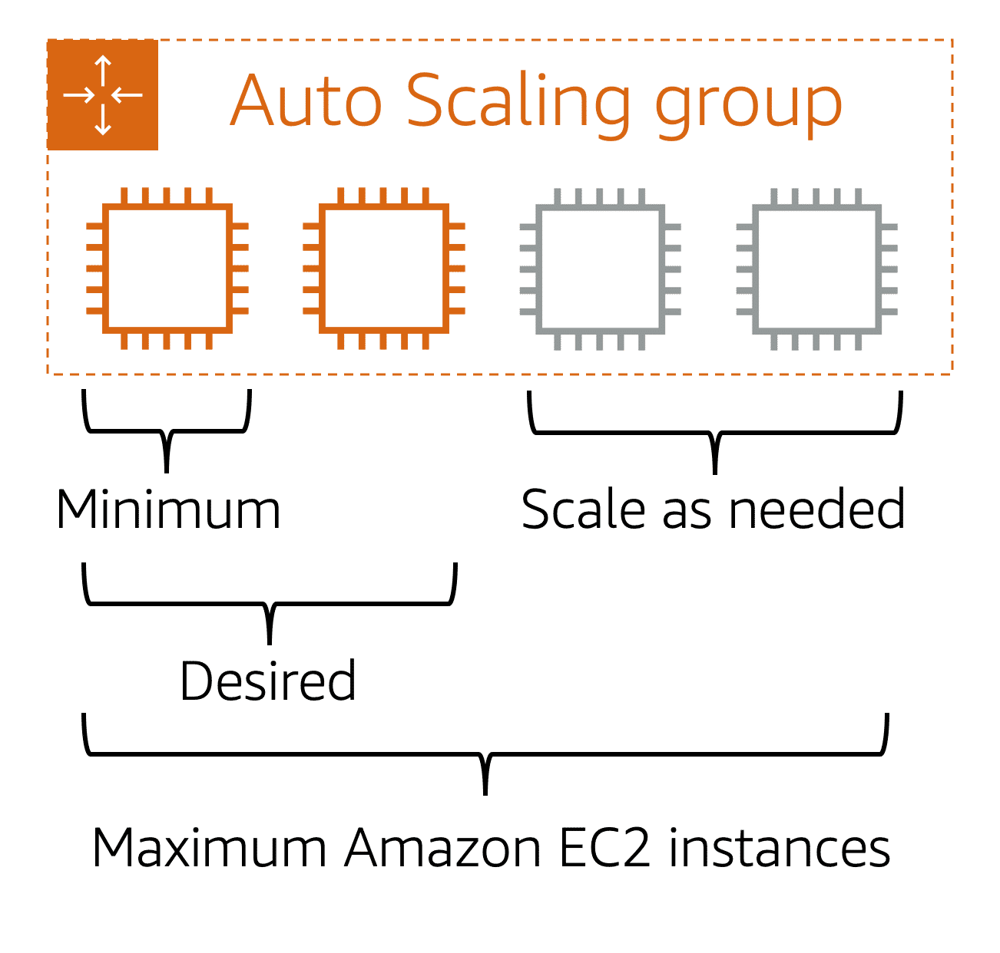

# AWS Cloud Practitioner Essentials

## 1 - Introduction to the AWS Cloud

### What is a client-server model?

In computing, a client can be a web browser or desktop application that a person interacts with to make requests to computer servers. A server can be services, such as Amazon Elastic Compute Cloud (Amazon EC2) – a type of virtual server.

For example, suppose that a client makes a request for a news article, the score in an online game, or a funny video. The server evaluates the details of this request and fulfills it by returning the information to the client.

### Deployment models for cloud computing

When selecting a cloud strategy, a company must consider factors such as required cloud application components, preferred resource management tools, and any legacy IT infrastructure requirements.

The three cloud computing deployment models are cloud-based, on-premises, and hybrid.

- **Cloud-based**  
    In a cloud-based deployment model, you can migrate existing applications to the cloud, or you can design and build new applications in the cloud. You can build those applications on low-level infrastructure that requires your IT staff to manage them. Alternatively, you can build them using higher-level services that reduce the management, architecting, and scaling requirements of the core infrastructure. For example, a company might create an application consisting of virtual servers, databases, and networking components that are fully based in the cloud.

- **On-premises**  
    On-premises deployment is also known as a private cloud deployment. In this model, resources are deployed on premises by using virtualization and resource management tools. For example, you might have applications that run on technology that is fully kept in your on-premises data center. Though this model is much like legacy IT infrastructure, its incorporation of application management and virtualization technologies helps to increase resource utilization.

- **Hybrid**  
    In a hybrid deployment, cloud-based resources are connected to on-premises infrastructure. You might want to use this approach in a number of situations. For example, you have legacy applications that are better maintained on premises, or government regulations require your business to keep certain records on premises. For example, suppose that a company wants to use cloud services that can automate batch data processing and analytics. However, the company has several legacy applications that are more suitable on premises and will not be migrated to the cloud. With a hybrid deployment, the company would be able to keep the legacy applications on premises while benefiting from the data and analytics services that run in the cloud.

### Benefits of cloud computing

Consider why a company might choose to take a particular cloud computing approach when addressing business needs.

- **Trade upfront expense for variable expense**  
    Upfront expense refers to data centers, physical servers, and other resources that you would need to invest in before using them. Variable expense means you only pay for computing resources you consume instead of investing heavily in data centers and servers before you know how you’re going to use them. By taking a cloud computing approach that offers the benefit of variable expense, companies can implement innovative solutions while saving on costs.

- **Stop spending money to run and mantain data centers**  
    Computing in data centers often requires you to spend more money and time managing infrastructure and servers. A benefit of cloud computing is the ability to focus less on these tasks and more on your applications and customers.

- **Stop guessing capacity**  
    With cloud computing, you don’t have to predict how much infrastructure capacity you will need before deploying an application. For example, you can launch Amazon EC2 instances when needed, and pay only for the compute time you use. Instead of paying for unused resources or having to deal with limited capacity, you can access only the capacity that you need. You can also scale in or scale out in response to demand.

- **Benefit from massive economies of scale**  
    By using cloud computing, you can achieve a lower variable cost than you can get on your own. Because usage from hundreds of thousands of customers can aggregate in the cloud, providers, such as AWS, can achieve higher economies of scale. The economy of scale translates into lower pay-as-you-go prices.

- **Increase speed and agility**  
    The flexibility of cloud computing makes it easier for you to develop and deploy applications. This flexibility provides you with more time to experiment and innovate. When computing in data centers, it may take weeks to obtain new resources that you need. By comparison, cloud computing enables you to access new resources within minutes.

- **Go global in minutes**  
    The global footprint of the AWS Cloud enables you to deploy applications to customers around the world quickly, while providing them with low latency. This means that even if you are located in a different part of the world than your customers, customers are able to access your applications with minimal delays.

## 2 - Compute in the Cloud

### Amazon Elastic Compute Cloud (Amazon EC2)

Amazon Elastic Compute Cloud (Amazon EC2)(opens in a new tab) provides secure, resizable compute capacity in the cloud as Amazon EC2 instances.

Imagine you are responsible for the architecture of your company's resources and need to support new websites. With traditional on-premises resources, you have to do the following:

- Spend money upfront to purchase hardware.
- Wait for the servers to be delivered to you.
- Install the servers in your physical data center.
- Make all the necessary configurations.

By comparison, with an Amazon EC2 instance you can use a virtual server to run applications in the AWS Cloud.

- You can provision and launch an Amazon EC2 instance within minutes.
- You can stop using it when you have finished running a workload.
- You pay only for the compute time you use when an instance is running, not when it is stopped or terminated.
- You can save costs by paying only for server capacity that you need or want.

### Amazon EC2 instance types

Amazon EC2 instance types(opens in a new tab) are optimized for different tasks. When selecting an instance type, consider the specific needs of your workloads and applications. This might include requirements for compute, memory, or storage capabilities.

- **General purpose**  
    General purpose instances provide a balance of compute, memory, and networking resources. You can use them for a variety of workloads, such as:
        - application servers
        - gaming servers
        - backend servers for enterprise applications
        - small and medium databases  
    Suppose that you have an application in which the resource needs for compute, memory, and networking are roughly equivalent. You might consider running it on a general purpose instance because the application does not require optimization in any single resource area.

- **Compute optimized**  
    Compute optimized instances are ideal for compute-bound applications that benefit from high-performance processors. Like general purpose instances, you can use compute optimized instances for workloads such as web, application, and gaming servers.  
    However, the difference is compute optimized applications are ideal for high-performance web servers, compute-intensive applications servers, and dedicated gaming servers. You can also use compute optimized instances for batch processing workloads that require processing many transactions in a single group.

- **Memory optimized**  
    Memory optimized instances are designed to deliver fast performance for workloads that process large datasets in memory. In computing, memory is a temporary storage area. It holds all the data and instructions that a central processing unit (CPU) needs to be able to complete actions. Before a computer program or application is able to run, it is loaded from storage into memory. This preloading process gives the CPU direct access to the computer program.  
    Suppose that you have a workload that requires large amounts of data to be preloaded before running an application. This scenario might be a high-performance database or a workload that involves performing real-time processing of a large amount of unstructured data. In these types of use cases, consider using a memory optimized instance. Memory optimized instances enable you to run workloads with high memory needs and receive great performance.

- **Accelerated computing**  
    Accelerated computing instances use hardware accelerators, or coprocessors, to perform some functions more efficiently than is possible in software running on CPUs. Examples of these functions include floating-point number calculations, graphics processing, and data pattern matching.  
    In computing, a hardware accelerator is a component that can expedite data processing. Accelerated computing instances are ideal for workloads such as graphics applications, game streaming, and application streaming.

- **Storage optimized**  
    Storage optimized instances are designed for workloads that require high, sequential read and write access to large datasets on local storage. Examples of workloads suitable for storage optimized instances include distributed file systems, data warehousing applications, and high-frequency online transaction processing (OLTP) systems.  
    In computing, the term input/output operations per second (IOPS) is a metric that measures the performance of a storage device. It indicates how many different input or output operations a device can perform in one second. Storage optimized instances are designed to deliver tens of thousands of low-latency, random IOPS to applications.  
    You can think of input operations as data put into a system, such as records entered into a database. An output operation is data generated by a server. An example of output might be the analytics performed on the records in a database. If you have an application that has a high IOPS requirement, a storage optimized instance can provide better performance over other instance types not optimized for this kind of use case.

### Amazon EC2 pricing

With Amazon EC2, you pay only for the compute time that you use. Amazon EC2 offers a variety of pricing options for different use cases. For example, if your use case can withstand interruptions, you can save with Spot Instances. You can also save by committing early and locking in a minimum level of use with Reserved Instances.

- **On-Demand Instances**  
    On-Demand Instances are ideal for short-term, irregular workloads that cannot be interrupted. No upfront costs or minimum contracts apply. The instances run continuously until you stop them, and you pay for only the compute time you use.  
    Sample use cases for On-Demand Instances include developing and testing applications and running applications that have unpredictable usage patterns. On-Demand Instances are not recommended for workloads that last a year or longer because these workloads can experience greater cost savings using Reserved Instances.

- **Reserved Instances**  
    Reserved Instances are a billing discount applied to the use of On-Demand Instances in your account. There are two available types of Reserved Instances:
        - Standard Reserved Instances
        - Convertible Reserved Instances  
    You can purchase Standard Reserved and Convertible Reserved Instances for a 1-year or 3-year term. You realize greater cost savings with the 3-year option.  
    Standard Reserved Instances: This option is a good fit if you know the EC2 instance type and size you need for your steady-state applications and in which AWS Region you plan to run them. Reserved Instances require you to state the following qualifications:
        - Instance type and size: For example, m5.xlarge
        - Platform description (operating system): For example, Microsoft Windows Server or Red Hat Enterprise Linux
        - Tenancy: Default tenancy or dedicated tenancy  
    You have the option to specify an Availability Zone for your EC2 Reserved Instances. If you make this specification, you get EC2 capacity reservation. This ensures that your desired amount of EC2 instances will be available when you need them.  
    Convertible Reserved Instances: If you need to run your EC2 instances in different Availability Zones or different instance types, then Convertible Reserved Instances might be right for you. Note: You trade in a deeper discount when you require flexibility to run your EC2 instances.  
    At the end of a Reserved Instance term, you can continue using the Amazon EC2 instance without interruption. However, you are charged On-Demand rates until you do one of the following:
        - Terminate the instance.
        - Purchase a new Reserved Instance that matches the instance attributes (instance family and size, Region, platform, and tenancy).

- **Instance Savings Plans**  
    AWS offers Savings Plans for a few compute services, including Amazon EC2. EC2 Instance Savings Plans reduce your EC2 instance costs when you make an hourly spend commitment to an instance family and Region for a 1-year or 3-year term. This term commitment results in savings of up to 72 percent compared to On-Demand rates. Any usage up to the commitment is charged at the discounted Savings Plans rate (for example, $10 per hour). Any usage beyond the commitment is charged at regular On-Demand rates.  
    The EC2 Instance Savings Plans are a good option if you need flexibility in your Amazon EC2 usage over the duration of the commitment term. You have the benefit of saving costs on running any EC2 instance within an EC2 instance family in a chosen Region (for example, M5 usage in N. Virginia) regardless of Availability Zone, instance size, OS, or tenancy. The savings with EC2 Instance Savings Plans are similar to the savings provided by Standard Reserved Instances.  
    Unlike Reserved Instances, however, you don't need to specify up front what EC2 instance type and size (for example, m5.xlarge), OS, and tenancy to get a discount. Further, you don't need to commit to a certain number of EC2 instances over a 1-year or 3-year term. Additionally, the EC2 Instance Savings Plans don't include an EC2 capacity reservation option.  

- **Spot Instances**  
    Spot Instances are ideal for workloads with flexible start and end times, or that can withstand interruptions. Spot Instances use unused Amazon EC2 computing capacity and offer you cost savings at up to 90% off of On-Demand prices.  
    Suppose that you have a background processing job that can start and stop as needed (such as the data processing job for a customer survey). You want to start and stop the processing job without affecting the overall operations of your business. If you make a Spot request and Amazon EC2 capacity is available, your Spot Instance launches. However, if you make a Spot request and Amazon EC2 capacity is unavailable, the request is not successful until capacity becomes available. The unavailable capacity might delay the launch of your background processing job.  
    After you have launched a Spot Instance, if capacity is no longer available or demand for Spot Instances increases, your instance may be interrupted. This might not pose any issues for your background processing job. However, in the earlier example of developing and testing applications, you would most likely want to avoid unexpected interruptions. Therefore, choose a different EC2 instance type that is ideal for those tasks.

- **Dedicated hosts**  
    Dedicated Hosts are physical servers with Amazon EC2 instance capacity that is fully dedicated to your use.  
    You can use your existing per-socket, per-core, or per-VM software licenses to help maintain license compliance. You can purchase On-Demand Dedicated Hosts and Dedicated Hosts Reservations. Of all the Amazon EC2 options that were covered, Dedicated Hosts are the most expensive.

### Scaling with Amazon EC2

Scalability involves beginning with only the resources you need and designing your architecture to automatically respond to changing demand by scaling out or in. As a result, you pay for only the resources you use. You don’t have to worry about a lack of computing capacity to meet your customers’ needs.

If you wanted the scaling process to happen automatically, which AWS service would you use? The AWS service that provides this functionality for Amazon EC2 instances is Amazon EC2 Auto Scaling.

If you’ve tried to access a website that wouldn’t load and frequently timed out, the website might have received more requests than it was able to handle. This situation is similar to waiting in a long line at a coffee shop, when there is only one barista present to take orders from customers.

Amazon EC2 Auto Scaling enables you to automatically add or remove Amazon EC2 instances in response to changing application demand. By automatically scaling your instances in and out as needed, you can maintain a greater sense of application availability.

Within Amazon EC2 Auto Scaling, you can use two approaches:

- Dynamic scaling responds to changing demand.

- Predictive scaling automatically schedules the right number of Amazon EC2 instances based on predicted demand.

In the cloud, computing power is a programmatic resource, so you can take a more flexible approach to the issue of scaling. By adding Amazon EC2 Auto Scaling to an application, you can add new instances to the application when necessary and terminate them when no longer needed.

Suppose that you are preparing to launch an application on Amazon EC2 instances. When configuring the size of your Auto Scaling group, you might set the minimum number of Amazon EC2 instances at one. This means that at all times, there must be at least one Amazon EC2 instance running.

When you create an Auto Scaling group, you can set the minimum number of Amazon EC2 instances. The minimum capacity is the number of Amazon EC2 instances that launch immediately after you have created the Auto Scaling group. In this example, the Auto Scaling group has a minimum capacity of one Amazon EC2 instance.

Next, you can set the desired capacity at two Amazon EC2 instances even though your application needs a minimum of a single Amazon EC2 instance to run.

The third configuration that you can set in an Auto Scaling group is the maximum capacity. For example, you might configure the Auto Scaling group to scale out in response to increased demand, but only to a maximum of four Amazon EC2 instances.

Because Amazon EC2 Auto Scaling uses Amazon EC2 instances, you pay for only the instances you use, when you use them. You now have a cost-effective architecture that provides the best customer experience while reducing expenses.

### Directing traffic with Elastic Load Balancing

Elastic Load Balancing is the AWS service that automatically distributes incoming application traffic across multiple resources, such as Amazon EC2 instances.

A load balancer acts as a single point of contact for all incoming web traffic to your Auto Scaling group. This means that as you add or remove Amazon EC2 instances in response to the amount of incoming traffic, these requests route to the load balancer first. Then, the requests spread across multiple resources that will handle them. For example, if you have multiple Amazon EC2 instances, Elastic Load Balancing distributes the workload across the multiple instances so that no single instance has to carry the bulk of it.

Although Elastic Load Balancing and Amazon EC2 Auto Scaling are separate services, they work together to help ensure that applications running in Amazon EC2 can provide high performance and availability.

Here’s an example of how Elastic Load Balancing works. Suppose that a few customers have come to the coffee shop and are ready to place their orders.

If only a few registers are open, this matches the demand of customers who need service. The coffee shop is less likely to have open registers with no customers. In this example, you can think of the registers as Amazon EC2 instances.

Throughout the day, as the number of customers increases, the coffee shop opens more registers to accommodate them.

Additionally, a coffee shop employee directs customers to the most appropriate register so that the number of requests can evenly distribute across the open registers. You can think of this coffee shop employee as a load balancer.

### Messaging and queuing services

Applications are made of multiple components. The components communicate with each other to transmit data, fulfill requests, and keep the application running.

Suppose that you have an application with tightly coupled components. These components might include databases, servers, the user interface, business logic, and so on. This type of architecture can be considered a monolithic application.

In this approach to application architecture, if a single component fails, other components fail, and possibly the entire application fails.

To help maintain application availability when a single component fails, you can design your application through a microservices approach.

In a microservices approach, application components are loosely coupled. In this case, if a single component fails, the other components continue to work because they are communicating with each other. The loose coupling prevents the entire application from failing.

When designing applications on AWS, you can take a microservices approach with services and components that fulfill different functions. Two services facilitate application integration: Amazon Simple Notification Service (Amazon SNS) and Amazon Simple Queue Service (Amazon SQS).

#### Amazon Simple Notification Service (Amazon SNS)

Amazon Simple Notification Service (Amazon SNS) is a publish/subscribe service. Using Amazon SNS topics, a publisher publishes messages to subscribers. This is similar to the coffee shop; the cashier provides coffee orders to the barista who makes the drinks.

Suppose that the coffee shop has a single newsletter that includes updates from all areas of its business. It includes topics such as coupons, coffee trivia, and new products. All of these topics are grouped because this is a single newsletter. All customers who subscribe to the newsletter receive updates about coupons, coffee trivia, and new products.

After a while, some customers express that they would prefer to receive separate newsletters for only the specific topics that interest them. The coffee shop owners decide to try this approach.

Now, instead of having a single newsletter for all topics, the coffee shop has broken it up into three separate newsletters. Each newsletter is devoted to a specific topic: coupons, coffee trivia, and new products.

Subscribers will now receive updates immediately for only the specific topics to which they have subscribed.

It is possible for subscribers to subscribe to a single topic or to multiple topics. For example, the first customer subscribes to only the coupons topic, and the second subscriber subscribes to only the coffee trivia topic. The third customer subscribes to both the coffee trivia and new products topics.

Although these examples from the coffee shop involve subscribers who are people, in Amazon SNS, subscribers can be web servers, email addresses, AWS Lambda functions, or several other options.

#### Amazon Simple Queue Service (Amazon SQS)

Using Amazon SQS, you can send, store, and receive messages between software components, without losing messages or requiring other services to be available. In Amazon SQS, an application sends messages into a queue. A user or service retrieves a message from the queue, processes it, and then deletes it from the queue.

Suppose that the coffee shop has an ordering process in which a cashier takes orders, and a barista makes the orders. Think of the cashier and the barista as two separate components of an application.

First, the cashier takes an order and writes it down on a piece of paper. Next, the cashier delivers the paper to the barista. Finally, the barista makes the drink and gives it to the customer.

When the next order comes in, the process repeats. This process runs smoothly as long as both the cashier and the barista are coordinated.

What might happen if the cashier took an order and went to deliver it to the barista, but the barista was out on a break or busy with another order? The cashier would need to wait until the barista is ready to accept the order. This would cause delays in the ordering process and require customers to wait longer to receive their orders.

As the coffee shop has become more popular and the ordering line is moving more slowly, the owners notice that the current ordering process is time consuming and inefficient. They decide to try a different approach that uses a queue.

Recall that the cashier and the barista are two separate components of an application. A message queuing service, such as Amazon SQS, lets messages between decoupled application complements.

In this example, the first step in the process remains the same as before: a customer places an order with the cashier.

The cashier puts the order into a queue. You can think of this as an order board that serves as a buffer between the cashier and the barista. Even if the barista is out on a break or busy with another order, the cashier can continue placing new orders into the queue.

Next, the barista checks the queue and retrieves the order.

The barista prepares the drink and gives it to the customer.

The barista then removes the completed order from the queue.

While the barista is preparing the drink, the cashier is able to continue taking new orders and add them to the queue.

For decoupled applications and microservices, Amazon SQS enables you to send, store, and retrieve messages between components.

This decoupled approach enables the separate components to work more efficiently and independently.

### Additional compute services

#### Serverless computing

If you have applications that you want to run in Amazon EC2, you must do the following:

- Provision instances (virtual servers).

- Upload your code.

- Continue to manage the instances while your application is running.

The term “serverless” means that your code runs on servers, but you do not need to provision or manage these servers. With serverless computing, you can focus more on innovating new products and features instead of maintaining servers.

Another benefit of serverless computing is the flexibility to scale serverless applications automatically. Serverless computing can adjust the applications' capacity by modifying the units of consumptions, such as throughput and memory.

AWS Lambda is a service that lets you run code without needing to provision or manage servers.

While using AWS Lambda, you pay only for the compute time that you consume. Charges apply only when your code is running. You can also run code for virtually any type of application or backend service, all with zero administration.

For example, a simple Lambda function might involve automatically resizing uploaded images to the AWS Cloud. In this case, the function triggers when uploading a new image.

#### Containers

Containers provide you with a standard way to package your application's code and dependencies into a single object. You can also use containers for processes and workflows in which there are essential requirements for security, reliability, and scalability.

Suppose that a company’s application developer has an environment on their computer that is different from the environment on the computers used by the IT operations staff. The developer wants to ensure that the application’s environment remains consistent regardless of deployment, so they use a containerized approach. This helps to reduce time spent debugging applications and diagnosing differences in computing environments.

When running containerized applications, it’s important to consider scalability. Suppose that instead of a single host with multiple containers, you have to manage tens of hosts with hundreds of containers. Alternatively, you have to manage possibly hundreds of hosts with thousands of containers. At a large scale, imagine how much time it might take for you to monitor memory usage, security, logging, and so on.

To help manage containers at scale, you can use Amazon Elastic Container Service (Amazon ECS) or Amazon Elastic Kubernetes Service (Amazon EKS).

#### Amazon Elastic Container Service (Amazon ECS)

Amazon Elastic Container Service (Amazon ECS) is a highly scalable, high-performance container management system that enables you to run and scale containerized applications on AWS.

Amazon ECS supports Docker containers. Docker is a software platform that enables you to build, test, and deploy applications quickly. AWS supports the use of open-source Docker Community Edition and subscription-based Docker Enterprise Edition. With Amazon ECS, you can use API calls to launch and stop Docker-enabled applications.

#### Amazon Elastic Kubernetes Service (Amazon EKS)

Amazon Elastic Kubernetes Service (Amazon EKS) is a fully managed service that you can use to run Kubernetes on AWS.

Kubernetes is open-source software that enables you to deploy and manage containerized applications at scale. A large community of volunteers maintains Kubernetes, and AWS actively works together with the Kubernetes community. As new features and functionalities release for Kubernetes applications, you can easily apply these updates to your applications managed by Amazon EKS.

#### AWS Fargate

AWS Fargate is a serverless compute engine for containers. It works with both Amazon ECS and Amazon EKS.

When using AWS Fargate, you do not need to provision or manage servers. AWS Fargate manages your server infrastructure for you. You can focus more on innovating and developing your applications, and you pay only for the resources that are required to run your containers.

## 3 - Global infrastructure and reliability

### AWS global infrastructure

To understand the AWS global infrastructure, consider the coffee shop. If an event such as a parade, flood, or power outage impacts one location, customers can still get their coffee by visiting a different location only a few blocks away.

This is similar to how the AWS global infrastructure works.

#### Regions

When determining the right Region for your services, data, and applications, consider the following four business factors.

- **Compliance with data governance requirements**  
    Depending on your company and location, you might need to run your data out of specific areas. For example, if your company requires all of its data to reside within the boundaries of the UK, you would choose the London Region.  
    Not all companies have location-specific data regulations, so you might need to focus more on the other three factors.

- **Proximity to customers**  
    Selecting a Region that is close to your customers will help you to get content to them faster. For example, your company is based in Washington, DC, and many of your customers live in Singapore. You might consider running your infrastructure in the Northern Virginia Region to be close to company headquarters, and run your applications from the Singapore Region.

- **Services available in a Region**
    Sometimes, the closest Region might not have all the features that you want to offer to customers. AWS is frequently innovating by creating new services and expanding on features within existing services. However, making new services available around the world sometimes requires AWS to build out physical hardware one Region at a time.  
    Suppose that your developers want to build an application that uses Amazon Braket (AWS quantum computing platform). As of this course, Amazon Braket is not yet available in every AWS Region around the world, so your developers would have to run it in one of the Regions that already offers it.

- **Pricing**  
    Suppose that you are considering running applications in both the United States and Brazil. The way Brazil’s tax structure is set up, it might cost 50% more to run the same workload out of the São Paulo Region compared to the Oregon Region. You will learn in more detail that several factors determine pricing, but for now know that the cost of services can vary from Region to Region.

#### Availability Zones

An Availability Zone is a single data center or a group of data centers within a Region. Availability Zones are located tens of miles apart from each other. This is close enough to have low latency (the time between when content requested and received) between Availability Zones. However, if a disaster occurs in one part of the Region, they are distant enough to reduce the chance that multiple Availability Zones are affected.

Suppose that you’re running an application on a single Amazon EC2 instance in the Northern California Region. The instance is running in the us-west-1a Availability Zone. If us-west-1a were to fail, you would lose your instance.

A best practice is to run applications across at least two Availability Zones in a Region. In this example, you might choose to run a second Amazon EC2 instance in us-west-1b.

If us-west-1a were to fail, your application would still be running in us-west-1b.

#### Edge locations

An edge location is a site that Amazon CloudFront uses to store cached copies of your content closer to your customers for faster delivery.

Suppose that your company’s data is stored in Brazil, and you have customers who live in China. To provide content to these customers, you don’t need to move all the content to one of the Chinese Regions.

Instead of requiring your customers to get their data from Brazil, you can cache a copy locally at an edge location that is close to your customers in China.

When a customer in China requests one of your files, Amazon CloudFront retrieves the file from the cache in the edge location and delivers the file to the customer. The file is delivered to the customer faster because it came from the edge location near China instead of the original source in Brazil.

#### AWS Management Console

The AWS Management Console is a web-based interface for accessing and managing AWS services. You can quickly access recently used services and search for other services by name, keyword, or acronym. The console includes wizards and automated workflows that can simplify the process of completing tasks.

You can also use the AWS Console mobile application to perform tasks such as monitoring resources, viewing alarms, and accessing billing information. Multiple identities can stay logged into the AWS Console mobile app at the same time.

#### AWS Command Line Interface (AWS CLI)

To save time when making API requests, you can use the AWS Command Line Interface (AWS CLI). AWS CLI enables you to control multiple AWS services directly from the command line within one tool. AWS CLI is available for users on Windows, macOS, and Linux.

By using AWS CLI, you can automate the actions that your services and applications perform through scripts. For example, you can use commands to launch an Amazon EC2 instance, connect an Amazon EC2 instance to a specific Auto Scaling group, and more.

#### AWS Software Development Kits (SDKs)

Another option for accessing and managing AWS services is the software development kits (SDKs). SDKs make it easier for you to use AWS services through an API designed for your programming language or platform. SDKs enable you to use AWS services with your existing applications or create entirely new applications that will run on AWS.

To help you get started with using SDKs, AWS provides documentation and sample code for each supported programming language. Supported programming languages include C++, Java, .NET, and more.

#### AWS Elastic Beanstalk

With AWS Elastic Beanstalk, you provide code and configuration settings, and Elastic Beanstalk deploys the resources necessary to perform the following tasks:

- Adjust capacity
- Load balancing
- Automatic scaling
- Application health monitoring

#### AWS CloudFormation

With AWS CloudFormation, you can treat your infrastructure as code. This means that you can build an environment by writing lines of code instead of using the AWS Management Console to individually provision resources.

AWS CloudFormation provisions your resources in a safe, repeatable manner, enabling you to frequently build your infrastructure and applications without having to perform manual actions. It determines the right operations to perform when managing your stack and rolls back changes automatically if it detects errors.

## 4 - Networking

### Connectivity to AWS

#### Amazon Virtual Private Cloud (Amazon VPC)

Imagine the millions of customers who use AWS services. Also, imagine the millions of resources that these customers have created, such as Amazon EC2 instances. Without boundaries around all of these resources, network traffic would be able to flow between them unrestricted.

A networking service that you can use to establish boundaries around your AWS resources is Amazon Virtual Private Cloud (Amazon VPC).

Amazon VPC enables you to provision an isolated section of the AWS Cloud. In this isolated section, you can launch resources in a virtual network that you define. Within a virtual private cloud (VPC), you can organize your resources into subnets. A subnet is a section of a VPC that can contain resources such as Amazon EC2 instances.

#### Internet Gateway

To allow public traffic from the internet to access your VPC, you attach an internet gateway to the VPC.

An internet gateway is a connection between a VPC and the internet. You can think of an internet gateway as being similar to a doorway that customers use to enter the coffee shop. Without an internet gateway, no one can access the resources within your VPC. But what if you have a VPC that includes only private resources?

#### Virtual private gateway

To access private resources in a VPC, you can use a virtual private gateway.

Here’s an example of how a virtual private gateway works. You can think of the internet as the road between your home and the coffee shop. Suppose that you are traveling on this road with a bodyguard to protect you. You are still using the same road as other customers, but with an extra layer of protection.

The bodyguard is like a virtual private network (VPN) connection that encrypts (or protects) your internet traffic from all the other requests around it.

The virtual private gateway is the component that allows protected internet traffic to enter into the VPC. Even though your connection to the coffee shop has extra protection, traffic jams are possible because you’re using the same road as other customers.

A virtual private gateway enables you to establish a virtual private network (VPN) connection between your VPC and a private network, such as an on-premises data center or internal corporate network. A virtual private gateway allows traffic into the VPC only if it is coming from an approved network.

#### Direct Connect

AWS Direct Connect is a service that lets you to establish a dedicated private connection between your data center and a VPC.  

Suppose that there is an apartment building with a hallway directly linking the building to the coffee shop. Only the residents of the apartment building can travel through this hallway.

This private hallway provides the same type of dedicated connection as AWS Direct Connect. Residents are able to get into the coffee shop without needing to use the public road shared with other customers.

The private connection that AWS Direct Connect provides helps you to reduce network costs and increase the amount of bandwidth that can travel through your network.

### Subnets and Network Access Control Lists (NACLs)

To learn more about the role of subnets within a VPC, review the following example from the coffee shop.

First, customers give their orders to the cashier. The cashier then passes the orders to the barista. This process allows the line to keep running smoothly as more customers come in.

Suppose that some customers try to skip the cashier line and give their orders directly to the barista. This disrupts the flow of traffic and results in customers accessing a part of the coffee shop that is restricted to them.

To fix this, the owners of the coffee shop divide the counter area by placing the cashier and the barista in separate workstations. The cashier’s workstation is public facing and designed to receive customers. The barista’s area is private. The barista can still receive orders from the cashier but not directly from customers.

This is similar to how you can use AWS networking services to isolate resources and determine exactly how network traffic flows.

In the coffee shop, you can think of the counter area as a VPC. The counter area divides into two separate areas for the cashier’s workstation and the barista’s workstation. In a VPC, subnets are separate areas that are used to group together resources.

#### Subnets

A subnet is a section of a VPC in which you can group resources based on security or operational needs. Subnets can be public or private.

**Public subnets** contain resources that need to be accessible by the public, such as an online store’s website.

**Private subnets** contain resources that should be accessible only through your private network, such as a database that contains customers’ personal information and order histories.

In a VPC, subnets can communicate with each other. For example, you might have an application that involves Amazon EC2 instances in a public subnet communicating with databases that are located in a private subnet.

#### Network traffic in a VPC

When a customer requests data from an application hosted in the AWS Cloud, this request is sent as a packet. A packet is a unit of data sent over the internet or a network.

It enters into a VPC through an internet gateway. Before a packet can enter into a subnet or exit from a subnet, it checks for permissions. These permissions indicate who sent the packet and how the packet is trying to communicate with the resources in a subnet.

The VPC component that checks packet permissions for subnets is a network access control list (ACL).

#### Network Access Control Lists (NACLs)

A network ACL is a virtual firewall that controls inbound and outbound traffic at the subnet level.

For example, step outside of the coffee shop and imagine that you are in an airport. In the airport, travelers are trying to enter into a different country. You can think of the travelers as packets and the passport control officer as a network ACL. The passport control officer checks travelers’ credentials when they are both entering and exiting out of the country. If a traveler is on an approved list, they are able to get through. However, if they are not on the approved list or are explicitly on a list of banned travelers, they cannot come in.

Each AWS account includes a default network ACL. When configuring your VPC, you can use your account’s default network ACL or create custom network ACLs.

By default, your account’s default network ACL allows all inbound and outbound traffic, but you can modify it by adding your own rules. For custom network ACLs, all inbound and outbound traffic is denied until you add rules to specify which traffic to allow. Additionally, all network ACLs have an explicit deny rule. This rule ensures that if a packet doesn’t match any of the other rules on the list, the packet is denied.

##### Stateless packet filtering

Network ACLs perform stateless packet filtering. They remember nothing and check packets that cross the subnet border each way: inbound and outbound.

Recall the previous example of a traveler who wants to enter into a different country. This is similar to sending a request out from an Amazon EC2 instance and to the internet.

When a packet response for that request comes back to the subnet, the network ACL does not remember your previous request. The network ACL checks the packet response against its list of rules to determine whether to allow or deny.

After a packet has entered a subnet, it must have its permissions evaluated for resources within the subnet, such as Amazon EC2 instances.

The VPC component that checks packet permissions for an Amazon EC2 instance is a security group.

#### Security groups

A security group is a virtual firewall that controls inbound and outbound traffic for an Amazon EC2 instance.

By default, a security group denies all inbound traffic and allows all outbound traffic. You can add custom rules to configure which traffic should be allowed; any other traffic would then be denied

For this example, suppose that you are in an apartment building with a door attendant who greets guests in the lobby. You can think of the guests as packets and the door attendant as a security group. As guests arrive, the door attendant checks a list to ensure they can enter the building. However, the door attendant does not check the list again when guests are exiting the building.

If you have multiple Amazon EC2 instances within the same VPC, you can associate them with the same security group or use different security groups for each instance.

##### Stateful packet filtering

Security groups perform stateful packet filtering. They remember previous decisions made for incoming packets.

Consider the same example of sending a request out from an Amazon EC2 instance to the internet.

When a packet response for that request returns to the instance, the security group remembers your previous request. The security group allows the response to proceed, regardless of inbound security group rules.

With both network ACLs and security groups, you can configure custom rules for the traffic in your VPC. As you continue to learn more about AWS security and networking, make sure to understand the differences between network ACLs and security groups.

### Global networking services

Suppose that AnyCompany has a website hosted in the AWS Cloud. Customers enter the web address into their browser, and they are able to access the website. This happens because of Domain Name System (DNS) resolution. DNS resolution involves a customer DNS resolver communicating with a company DNS server.

You can think of DNS as being the phone book of the internet. DNS resolution is the process of translating a domain name to an IP address.

When a customer enters a domain name into their browser, the customer’s DNS resolver sends a request to a company DNS server. The company DNS server then sends a request to a DNS resolver that is authoritative for the domain name. The authoritative DNS resolver sends a response back to the company DNS server, which then sends a response back to the customer’s DNS resolver. The customer’s DNS resolver then sends the IP address back to the customer’s browser.

#### Amazon Route 53

Amazon Route 53 is a DNS web service. It gives developers and businesses a reliable way to route end users to internet applications hosted in AWS.

Amazon Route 53 connects user requests to infrastructure running in AWS (such as Amazon EC2 instances and load balancers). It can route users to infrastructure outside of AWS.

Another feature of Route 53 is the ability to manage the DNS records for domain names. You can register new domain names directly in Route 53. You can also transfer DNS records for existing domain names managed by other domain registrars. This enables you to manage all of your domain names within a single location.

In the previous module, you learned about Amazon CloudFront, a content delivery service. The following example describes how Route 53 and Amazon CloudFront work together to deliver content to customers.

Suppose that AnyCompany’s application is running on several Amazon EC2 instances. These instances are in an Auto Scaling group that attaches to an Application Load Balancer.

- A customer requests data from the application by going to AnyCompany’s website.

- Amazon Route 53 uses DNS resolution to identify AnyCompany.com’s corresponding IP address, 192.0.2.0. This information is sent back to the customer.

- The customer’s request is sent to the nearest edge location through Amazon CloudFront.

- Amazon CloudFront connects to the Application Load Balancer, which sends the incoming packet to an Amazon EC2 instance.

## 5 - Storage and databases

